- [2. Pruebas Unitarias y Dobles de Prueba](#2-pruebas-unitarias-y-dobles-de-prueba)
  - [2.1. Filosofía del Testing Unitario](#21-filosofía-del-testing-unitario)
    - [2.1.1. Los Principios F.I.R.S.T.](#211-los-principios-first)
    - [2.1.2. Estructura de un Test: El Patrón AAA (Arrange, Act, Assert)](#212-estructura-de-un-test-el-patrón-aaa-arrange-act-assert)
  - [2.2. Java 25: JUnit 5 y Mockito](#22-java-25-junit-5-y-mockito)
    - [2.2.1. Ciclo de Vida de JUnit 5](#221-ciclo-de-vida-de-junit-5)
    - [2.2.2. Anotaciones Esenciales de JUnit 5](#222-anotaciones-esenciales-de-junit-5)
    - [2.2.3. Mockito: El Arte de los Dobles de Prueba](#223-mockito-el-arte-de-los-dobles-de-prueba)
    - [2.2.4. 🛠️ Configuración Profesional: Gradle con Kotlin DSL](#️-configuración-profesional-gradle-con-kotlin-dsl)
    - [2.2.5. Código de Ejemplo: Sistema de Usuarios (Java 25)](#código-de-ejemplo-sistema-de-usuarios-java-25)
  - [2.3. .NET 10: NUnit y Moq](#23-net-10-nunit-y-moq)
    - [2.3.1. Ciclo de Vida de NUnit](#231-ciclo-de-vida-de-nunit)
    - [2.3.2. Atributos Esenciales de NUnit](#232-atributos-esenciales-de-nunit)
    - [2.3.3. Moq: Dobles de Prueba en .NET](#233-moq-dobles-de-prueba-en-net)
    - [2.3.4. 🛠️ Configuración Profesional: .NET 10 y Cobertura](#️-configuración-profesional-net-10-y-cobertura)
    - [2.3.5. Código de Ejemplo: Sistema de Usuarios (C# 14)](#código-de-ejemplo-sistema-de-usuarios-c-14)
  - [2.4. Cobertura de Código (Code Coverage)](#24-cobertura-de-código-code-coverage)
    - [2.4.1. 🛠️ JaCoCo en Java (Gradle Kotlin DSL)](#️-jacoco-en-java-gradle-kotlin-dsl)
      - [2.4.1.1. Aplicar el Plugin](#2411-aplicar-el-plugin)
      - [2.4.1.2. Configurar el Reporte](#2412-configurar-el-reporte)
      - [2.4.1.3. Forzar el "Build Fail" por Cobertura](#2413-forzar-el-build-fail-por-cobertura)
      - [2.4.1.4. Ejecución en Terminal](#2414-ejecución-en-terminal)
    - [2.4.2. 🛠️ Coverlet en .NET 10 (C# 14)](#️-coverlet-en-net-10-c-14)
      - [2.4.2.1. Instalación de Dependencias](#2421-instalación-de-dependencias)
      - [2.4.2.2. Ejecución y Recolección de Datos](#2422-ejecución-y-recolección-de-datos)
      - [2.4.2.3. Generar el Reporte HTML Profesional](#2423-generar-el-reporte-html-profesional)
      - [2.4.2.4. Automatización en un script](#2424-automatización-en-un-script)
    - [2.4.3. 💡 Resumen para el Alumno: ¿Qué mirar en el reporte?](#-resumen-para-el-alumno-qué-mirar-en-el-reporte)


# 2. Pruebas Unitarias y Dobles de Prueba


## 2.1. Filosofía del Testing Unitario

Antes de tocar una sola línea de código de test, debemos entender qué hace que un test sea "bueno". La industria se rige por dos estándares fundamentales: los principios **F.I.R.S.T.** y el patrón **AAA**.

### 2.1.1. Los Principios F.I.R.S.T.

Un test unitario de calidad debe cumplir estas cinco reglas:

1.  **F (Fast - Rápido):** Los tests deben ejecutarse en milisegundos. Si el programador siente pereza al ejecutarlos porque tardan demasiado, dejará de hacerlo.
2.  **I (Independent - Independiente):** Un test no debe depender de otro. No debe importar el orden de ejecución. Cada test debe preparar su propio estado y limpiarlo al terminar.
3.  **R (Repeatable - Repetible):** Debe devolver el mismo resultado en cualquier entorno (tu PC, el servidor de CI, el PC de un compañero) sin importar factores externos como la hora, el clima o la base de datos.
4.  **S (Self-Validating - Auto-validable):** El test debe pasar o fallar por sí solo. No debe requerir que un humano mire un log para saber si el resultado fue correcto.
5.  **T (Timely - Oportuno):** Se escriben en el momento justo. Bajo la filosofía **TDD (Test Driven Development)**, se escriben incluso *antes* que el código de producción.

### 2.1.2. Estructura de un Test: El Patrón AAA (Arrange, Act, Assert)

Para que un test sea legible, dividimos su cuerpo en tres bloques claros:

*   **Arrange (Organizar/Preparar):** Configuramos el escenario. Creamos los objetos, configuramos los mocks y preparamos las variables de entrada.
*   **Act (Actuar):** Ejecutamos el método o acción que queremos probar. Suele ser una única línea de código.
*   **Assert (Afirmar/Verificar):** Comprobamos que el resultado obtenido coincide con el esperado. Si esta parte falla, el test falla.

> **Nota:** En entornos BDD (Behavior Driven Development), este patrón se conoce como **Given / When / Then**.

---

## 2.2. Java 25: JUnit 5 y Mockito

Java 25 continúa la evolución de la plataforma permitiendo tests más concisos gracias a los Records y el Pattern Matching. Usaremos **JUnit 5 (Jupiter)** como motor de ejecución.

### 2.2.1. Ciclo de Vida de JUnit 5

```mermaid
flowchart LR
    A["@BeforeAll<br/>Una vez al inicio"] --> B["@BeforeEach<br/>Antes de cada test"]
    B --> C["@Test<br/>La prueba"]
    C --> D["@AfterEach<br/>Después de cada test"]
    D --> E["@AfterAll<br/>Una vez al final"]

```



### 2.2.5. Código de Ejemplo: Sistema de Usuarios (Java 25)

**Servicio a probar:**
```java
public record User(Long id, String username, String email) {}

public class UserService {
    private final UserRepository repository;

    public UserService(UserRepository repository) {
        this.repository = repository;
    }

    public User register(String username, String email) {
        if (repository.existsByUsername(username)) {
            throw new IllegalArgumentException("User already exists");
        }
        return repository.save(new User(null, username, email));
    }
}
```

**Test Unitario Profundo:**
```java
@ExtendWith(MockitoExtension.class)
@DisplayName("Pruebas de Servicio de Usuarios")
class UserServiceTest {

    @Mock
    UserRepository userRepository;

    @InjectMocks
    UserService userService;

    @BeforeEach
    void setUp() {
        // Configuración común antes de cada test si fuera necesaria
    }

    @Nested
    @DisplayName("Escenarios de Registro")
    class RegisterScenarios {

        @Test
        @DisplayName("Debe registrar un usuario correctamente")
        void shouldRegisterUser() {
            // Arrange (AAA)
            String username = "joseluisgs";
            when(userRepository.existsByUsername(username)).thenReturn(false);
            when(userRepository.save(any(User.class)))
                .thenReturn(new User(1L, username, "test@test.com"));

            // Act
            User result = userService.register(username, "test@test.com");

            // Assert
            assertThat(result.id()).isEqualTo(1L);
            verify(userRepository, times(1)).save(any());
        }

        @ParameterizedTest
        @ValueSource(strings = {"admin", "root", "superuser"})
        @DisplayName("Debe fallar si el nombre de usuario ya existe")
        void shouldFailIfUsernameExists(String existingUser) {
            // Arrange
            when(userRepository.existsByUsername(existingUser)).thenReturn(true);

            // Act & Assert
            assertThrows(IllegalArgumentException.class, () -> 
                userService.register(existingUser, "test@test.com")
            );
        }
    }
}
```

---

## 2.3. .NET 10: NUnit y Moq

En el ecosistema .NET, **NUnit** es el framework más veterano y robusto, mientras que **Moq** es el estándar de facto para dobles de prueba.

### 2.3.1. Ciclo de Vida de NUnit

```mermaid
flowchart LR
    A["[OneTimeSetUp]<br/>Una vez al inicio"] --> B["[SetUp]<br/>Antes de cada test"]
    B --> C["[Test]<br/>La prueba"]
    C --> D["[TearDown]<br/>Después de cada test"]
    D --> E["[OneTimeTearDown]<br/>Una vez al final"]

```



**Comando para ejecutar con cobertura (formato lcov/cobertura):**
```bash
dotnet test --collect:"XPlat Code Coverage"
```

### 2.3.5. Código de Ejemplo: Sistema de Usuarios (C# 14)

Aprovechamos los **Primary Constructors** de C# 14 para dependencias más limpias.

**Servicio a probar:**
```csharp
public record User(long? Id, string Username, string Email);

public class UserService(IUserRepository repository) 
{
    public User Register(string username, string email) 
    {
        if (repository.ExistsByUsername(username)) 
            throw new ArgumentException("User already exists");
            
        return repository.Save(new User(null, username, email));
    }
}
```

**Test Unitario con Moq y FluentAssertions:**
```csharp
[TestFixture]
public class UserServiceTests 
{
    private Mock<IUserRepository> _repositoryMock;
    private UserService _userService;

    [SetUp]
    public void SetUp() 
    {
        _repositoryMock = new Mock<IUserRepository>();
        // Inyectamos el .Object del mock
        _userService = new UserService(_repositoryMock.Object);
    }

    [Test]
    public void Register_ValidUser_ReturnsSavedUser() 
    {
        // Arrange
        var username = "joseluisgs";
        _repositoryMock.Setup(r => r.ExistsByUsername(username)).Returns(false);
        _repositoryMock.Setup(r => r.Save(It.IsAny<User>()))
                       .Returns(new User(1, username, "test@test.com"));

        // Act
        var result = _userService.Register(username, "test@test.com");

        // Assert (Usando FluentAssertions para legibilidad)
        result.Id.Should().Be(1);
        result.Username.Should().Be(username);
        
        _repositoryMock.Verify(r => r.Save(It.IsAny<User>()), Times.Once);
    }

    [TestCase("admin")]
    [TestCase("root")]
    public void Register_ExistingUser_ThrowsArgumentException(string existingUser) 
    {
        // Arrange
        _repositoryMock.Setup(r => r.ExistsByUsername(existingUser)).Returns(true);

        // Act
        Action act = () => _userService.Register(existingUser, "test@test.com");

        // Assert
        act.Should().Throw<ArgumentException>().WithMessage("User already exists");
    }
}
```

---

## 2.4. Cobertura de Código (Code Coverage)

La cobertura no es solo un porcentaje; es un mapa de calor que nos dice dónde es más probable que se escondan los bugs. Un **80% de cobertura** es el estándar de oro en la industria.

### 2.4.1. 🛠️ JaCoCo en Java (Gradle Kotlin DSL)

JaCoCo (Java Code Coverage) es el estándar para el ecosistema JVM. En Gradle con Kotlin DSL, su configuración es muy potente.

#### 2.4.1.1. Aplicar el Plugin
En tu `build.gradle.kts`:
```kotlin
plugins {
    java
    jacoco // 1. Aplicamos el plugin
}
```

#### 2.4.1.2. Configurar el Reporte
Debemos decirle a JaCoCo qué formatos queremos y dónde generarlos.
```kotlin
tasks.jacocoTestReport {
    dependsOn(tasks.test) // Asegura que los tests corren antes del reporte
    reports {
        xml.required.set(true)
        html.required.set(true)
        // El reporte HTML se guardará en: build/reports/jacoco/test/html/index.html
    }
}
```

#### 2.4.1.3. Forzar el "Build Fail" por Cobertura
Esta es la configuración de un entorno profesional de despliegue. Si la cobertura baja del mínimo, el proyecto no compila.
```kotlin
tasks.jacocoTestCoverageVerification {
    violationRules {
        rule {
            limit {
                minimum = "0.80".toBigDecimal() // Exigimos el 80%
            }
        }
        rule {
            element = "CLASS"
            includes = listOf("com.example.service.*")
            limit {
                counter = "LINE"
                value = "COVEREDRATIO"
                minimum = "0.90".toBigDecimal() // En servicios queremos el 90%
            }
        }
    }
}
```

#### 2.4.1.4. Ejecución en Terminal
```bash
./gradlew test jacocoTestReport jacocoTestCoverageVerification
```

---

### 2.4.2. 🛠️ Coverlet en .NET 10 (C# 14)

Siguiendo el patrón de **TiendaDawWeb-NetCore**, usamos `coverlet` para recolectar datos y `ReportGenerator` para visualizarlos.

#### 2.4.2.1. Instalación de Dependencias
Asegúrate de que tu proyecto de tests tenga estos paquetes (normalmente ya vienen en el template de NUnit):
```bash
dotnet add package coverlet.collector
dotnet add package coverlet.msbuild
```

#### 2.4.2.2. Ejecución y Recolección de Datos
Ejecutamos los tests indicando que queremos recolectar cobertura en un formato compatible (cobertura.xml).
```bash
dotnet test --collect:"XPlat Code Coverage"
```
*Esto generará una carpeta `TestResults` con un archivo `coverage.cobertura.xml`.*

#### 2.4.2.3. Generar el Reporte HTML Profesional
El XML de coverlet es ilegible para humanos. Usamos la herramienta global `ReportGenerator`:

**Instalación (solo una vez):**
```bash
dotnet tool install -g dotnet-reportgenerator-globaltool
```

**Generación del reporte:**
```bash
reportgenerator \
  -reports:"TestResults/**/coverage.cobertura.xml" \
  -targetdir:"coveragereport" \
  -reporttypes:Html
```

#### 2.4.2.4. Automatización en un script
Es común tener un fichero `coverage.sh` o `coverage.ps1` con lo siguiente:
```bash
# Script rápido para ver cobertura
dotnet test --collect:"XPlat Code Coverage"
reportgenerator "-reports:TestResults/**/coverage.cobertura.xml" "-targetdir:coveragereport" -reporttypes:Html
start coveragereport/index.html
```

---

### 2.4.3. 💡 Resumen para el Alumno: ¿Qué mirar en el reporte?
*   **Verde:** Código probado. ¡Bien!
*   **Rojo:** Código muerto o lógica crítica olvidada.
*   **Amarillo (Branch Coverage):** Has probado el `if`, pero nunca el `else`. Tu test está incompleto.