- [3. Integración Real con Testcontainers](#3-integración-real-con-testcontainers)
  - [3.1. El Fin de los Mocks en Bases de Datos](#31-el-fin-de-los-mocks-en-bases-de-datos)
    - [3.1.1. El Problema con los Mocks de BD](#311-el-problema-con-los-mocks-de-bd)
    - [3.1.2. La Solución:  Testcontainers](#312-la-solución--testcontainers)
  - [3.2. Implementación en Spring Boot (Java)](#32-implementación-en-spring-boot-java)
    - [3.2.1. 🛠️ Paso a Paso: Configuración del Proyecto](#️-paso-a-paso-configuración-del-proyecto)
    - [3.2.2. Código de la Aplicación](#321-código-de-la-aplicación)
    - [3.2.3. Tests de Integración con Testcontainers](#322-tests-de-integración-con-testcontainers)
    - [3.2.4. Características Avanzadas de Testcontainers](#323-características-avanzadas-de-testcontainers)
  - [3.3.  Implementación en .NET](#33--implementación-en-net)
    - [3.3.1. 🛠️ Paso a Paso:  Configuración del Proyecto](#️-paso-a-paso--configuración-del-proyecto)
    - [3.3.2. Código de la Aplicación](#332-código-de-la-aplicación-1)
    - [3.3.3. Tests de Integración con Testcontainers](#333-tests-de-integración-con-testcontainers-1)
    - [3.3.4. Ejecutar los Tests](#334-ejecutar-los-tests)


# 3. Integración Real con Testcontainers

## 3.1. El Fin de los Mocks en Bases de Datos

### 3.1.1. El Problema con los Mocks de BD

Hasta ahora hemos mockeado los repositorios, lo cual es perfecto para **pruebas unitarias**.  Pero los mocks tienen limitaciones significativas:

| Aspecto           | Con Mocks     | Con BD Real               |
| ----------------- | ------------- | ------------------------- |
| **Consultas SQL** | No se prueban | Se ejecutan realmente     |
| **Constraints**   | No se validan | Se verifican (FK, UNIQUE) |
| **Transacciones** | Simuladas     | Comportamiento real       |
| **Performance**   | No se mide    | Detectable                |
| **Dialecto SQL**  | Ignorado      | Específico del motor      |

**Ejemplo de Bug NO Detectado con Mocks:**

```java
// Repository con bug sutil
public List<User> findActiveUsers() {
    return entityManager.createQuery(
        "SELECT u FROM User u WHERE u.active = 1", // ❌ Bug: active es boolean, no int
        User.class
    ).getResultList();
}

// Test unitario con mock - PASA ✅ (no ejecuta SQL)
@Test
void testFindActiveUsers() {
    when(repository.findActiveUsers()).thenReturn(List.of(user1, user2));
    List<User> result = service.getActiveUsers();
    assertThat(result).hasSize(2); // ✅ Pasa con mock
}

// Realidad en producción - FALLA ❌
// org.hibernate.exception.SQLGrammarException: could not execute query
```

### 3.1.2. La Solución:  Testcontainers

```mermaid
flowchart TB
    subgraph Test["Test de Integración"]
        TC["Testcontainers<br/>Library"]
        DB[("PostgreSQL Docker Container")]
        Redis[("Redis Docker Container")]
        Kafka["Kafka Docker Container"]
    end
    
    subgraph CI["Pipeline CI/CD"]
        Git["Git Push"]
        Build["Build + Test"]
        Deploy["Deploy"]
    end
    
    TC -->|Inicia| DB
    TC -->|Inicia| Redis
    TC -->|Inicia| Kafka
    Git --> Build --> Deploy
```



**Testcontainers** es una biblioteca Java (con ports para . NET, Go, Python, Node.js, etc.) que permite ejecutar **contenedores Docker desde los tests**, proporcionando:

- ✅ Bases de datos reales (PostgreSQL, MySQL, MongoDB, etc.)
- ✅ Colas de mensajes (RabbitMQ, Kafka)
- ✅ Servicios externos (Redis, Elasticsearch)
- ✅ Navegadores (Selenium)
- ✅ Cualquier cosa que tenga imagen Docker

**Ventajas Clave:**

1. **Aislamiento**: Cada test suite tiene su propia BD limpia
2. **Realismo**: Comportamiento idéntico a producción
3. **Portabilidad**: Funciona en cualquier máquina con Docker
4. **Automatización**: Se gestiona todo desde código

💡 **Nota del Profesor**: Testcontainers revolucionó el testing de integración. Antes necesitábamos BD instaladas localmente, scripts de setup complejos y limpieza manual. Ahora todo es automático y reproducible.

---

## 3.2. Implementación en Spring Boot (Java)

### 3.2.1. 🛠️ Paso a Paso: Configuración del Proyecto

**1. Actualizar `build.gradle.kts` con dependencias de integración:**

```kotlin
plugins {
    java
    jacoco
    id("org.springframework.boot") version "3.3.0"
    id("io.spring.dependency-management") version "1.1.5"
}

group = "com.example"
version = "1.0.0"

java {
    toolchain {
        languageVersion. set(JavaLanguageVersion.of(21))
    }
}

repositories {
    mavenCentral()
}

dependencies {
    // Spring Boot
    implementation("org. springframework.boot:spring-boot-starter-data-jpa")
    implementation("org.springframework.boot:spring-boot-starter-web")
    implementation("org.springframework.boot:spring-boot-starter-validation")
    
    // PostgreSQL
    runtimeOnly("org.postgresql:postgresql")
    
    // Testing
    testImplementation("org. springframework.boot:spring-boot-starter-test")
    testImplementation(platform("org.testcontainers:testcontainers-bom:1.19.8"))
    testImplementation("org.testcontainers:testcontainers")
    testImplementation("org.testcontainers:junit-jupiter")
    testImplementation("org.testcontainers:postgresql")
    
    testImplementation("org.junit.jupiter:junit-jupiter")
    testImplementation("org. mockito:mockito-core: 5.11.0")
    testImplementation("org.assertj:assertj-core:3.25.3")
}

tasks.test {
    useJUnitPlatform()
}
```

**2. Estructura del Proyecto:**

```
proyecto-spring-testcontainers/
├── src/
│   ├── main/
│   │   ├── java/com/example/
│   │   │   ├── UserApplication.java
│   │   │   ├── entity/
│   │   │   │   └── UserEntity.java
│   │   │   ├── repository/
│   │   │   │   └── UserRepository.java
│   │   │   ├── service/
│   │   │   │   └── UserService. java
│   │   │   └── dto/
│   │   │       └── CreateUserRequest.java
│   │   └── resources/
│   │       └── application.yml
│   └── test/
│       ├── java/com/example/
│       │   ├── integration/
│       │   │   └── UserServiceIntegrationTest.java
│       │   └── repository/
│       │       └── UserRepositoryTest.java
│       └── resources/
│           └── application-test.yml
```

### Código de la Aplicación

**UserEntity.java**

```java
package com.example.entity;

import jakarta.persistence.*;
import java.time.LocalDateTime;
import java.util.Objects;

@Entity
@Table(name = "users", uniqueConstraints = {
    @UniqueConstraint(name = "uk_username", columnNames = "username"),
    @UniqueConstraint(name = "uk_email", columnNames = "email")
})
public class UserEntity {
    
    @Id
    @GeneratedValue(strategy = GenerationType. IDENTITY)
    private Long id;
    
    @Column(nullable = false, length = 20)
    private String username;
    
    @Column(nullable = false, length = 100)
    private String email;
    
    @Column(nullable = false)
    private String password;
    
    @Column(nullable = false)
    private Boolean active = true;
    
    @Column(name = "created_at", nullable = false, updatable = false)
    private LocalDateTime createdAt;
    
    @PrePersist
    protected void onCreate() {
        createdAt = LocalDateTime.now();
    }
    
    // Constructors
    public UserEntity() {}
    
    public UserEntity(String username, String email, String password) {
        this.username = username;
        this.email = email;
        this.password = password;
    }
    
    // Getters y Setters
    public Long getId() { return id; }
    public void setId(Long id) { this.id = id; }
    
    public String getUsername() { return username; }
    public void setUsername(String username) { this.username = username; }
    
    public String getEmail() { return email; }
    public void setEmail(String email) { this.email = email; }
    
    public String getPassword() { return password; }
    public void setPassword(String password) { this.password = password; }
    
    public Boolean getActive() { return active; }
    public void setActive(Boolean active) { this.active = active; }
    
    public LocalDateTime getCreatedAt() { return createdAt; }
    
    @Override
    public boolean equals(Object o) {
        if (this == o) return true;
        if (o == null || getClass() != o.getClass()) return false;
        UserEntity that = (UserEntity) o;
        return Objects.equals(id, that.id);
    }
    
    @Override
    public int hashCode() {
        return Objects.hash(id);
    }
}
```

**UserRepository.java (Spring Data JPA)**

```java
package com.example.repository;

import com.example.entity.UserEntity;
import org.springframework.data.jpa.repository.JpaRepository;
import org.springframework.data.jpa.repository.Query;
import org.springframework.stereotype.Repository;

import java.util.List;
import java.util.Optional;

@Repository
public interface UserRepository extends JpaRepository<UserEntity, Long> {
    
    Optional<UserEntity> findByUsername(String username);
    
    Optional<UserEntity> findByEmail(String email);
    
    boolean existsByUsername(String username);
    
    boolean existsByEmail(String email);
    
    @Query("SELECT u FROM UserEntity u WHERE u.active = true")
    List<UserEntity> findAllActive();
    
    @Query("SELECT u FROM UserEntity u WHERE u.username LIKE %: pattern%")
    List<UserEntity> searchByUsername(String pattern);
}
```

**application.yml**

```yaml
spring:
  application:
    name: user-management
  
  datasource:
    url:  ${DATABASE_URL:jdbc:postgresql://localhost:5432/userdb}
    username: ${DATABASE_USER:postgres}
    password: ${DATABASE_PASSWORD:postgres}
    driver-class-name: org. postgresql.Driver
  
  jpa:
    hibernate:
      ddl-auto: update
    show-sql: true
    properties:
      hibernate:
        format_sql: true
        dialect: org.hibernate.dialect.PostgreSQLDialect
```

**application-test.yml**

```yaml
spring:
  jpa:
    hibernate:
      ddl-auto: create-drop
    show-sql: true
```

### Tests de Integración con Testcontainers

**AbstractIntegrationTest.java (Clase Base)**

```mermaid
flowchart TB
    subgraph Container["Contenedor Docker"]
        Postgres["PostgreSQL:16-Alpine<br/>Puerto:随机"]
        DB["testdb"]
    end
    
    subgraph Test["Test Class"]
        Setup["@BeforeAll<br/>Iniciar contenedor"]
        Run["@BeforeEach<br/>Limpiar datos"]
        Execute["@Test<br/>Ejecutar test"]
        Cleanup["@AfterAll<br/>Detener contenedor"]
    end
    
    Setup --> Run --> Execute --> Cleanup
    Postgres --> DB
    DB --> User
    User --> Pass
```



```java
package com.example.integration;

import org.springframework.boot.test.context.SpringBootTest;
import org.springframework.boot.testcontainers.service. connection.ServiceConnection;
import org.springframework.test.context.ActiveProfiles;
import org.testcontainers.containers.PostgreSQLContainer;
import org.testcontainers.junit.jupiter.Container;
import org.testcontainers.junit. jupiter.Testcontainers;

@SpringBootTest
@Testcontainers
@ActiveProfiles("test")
public abstract class AbstractIntegrationTest {
    
    @Container
    @ServiceConnection
    static PostgreSQLContainer<?> postgres = new PostgreSQLContainer<>("postgres:16-alpine")
            .withDatabaseName("testdb")
            .withUsername("testuser")
            .withPassword("testpass");
}
```

💡 **Nota del Profesor**: La anotación `@ServiceConnection` de Spring Boot 3.1+ configura automáticamente el datasource usando los datos del contenedor.  Es una simplificación enorme comparada con versiones anteriores donde había que configurar manualmente las propiedades.

**UserRepositoryTest.java**

```java
package com.example.repository;

import com.example.entity. UserEntity;
import com.example.integration.AbstractIntegrationTest;
import org.junit.jupiter.api.BeforeEach;
import org. junit.jupiter.api.DisplayName;
import org.junit. jupiter.api.Test;
import org.springframework.beans.factory. annotation.Autowired;
import org.springframework.dao.DataIntegrityViolationException;

import java.util.List;
import java.util.Optional;

import static org.assertj.core.api.Assertions.*;

@DisplayName("UserRepository - Tests de Integración")
class UserRepositoryTest extends AbstractIntegrationTest {
    
    @Autowired
    private UserRepository userRepository;
    
    @BeforeEach
    void setUp() {
        userRepository.deleteAll();
    }
    
    @Test
    @DisplayName("Debe guardar usuario correctamente")
    void shouldSaveUser() {
        // Given
        UserEntity user = new UserEntity("john_doe", "john@example.com", "hashedpass");
        
        // When
        UserEntity saved = userRepository.save(user);
        
        // Then
        assertThat(saved.getId()).isNotNull();
        assertThat(saved.getUsername()).isEqualTo("john_doe");
        assertThat(saved.getCreatedAt()).isNotNull();
        assertThat(saved.getActive()).isTrue();
    }
    
    @Test
    @DisplayName("Debe encontrar usuario por username")
    void shouldFindByUsername() {
        // Given
        UserEntity user = new UserEntity("jane_smith", "jane@example. com", "hashedpass");
        userRepository.save(user);
        
        // When
        Optional<UserEntity> found = userRepository.findByUsername("jane_smith");
        
        // Then
        assertThat(found).isPresent();
        assertThat(found.get().getEmail()).isEqualTo("jane@example.com");
    }
    
    @Test
    @DisplayName("Debe retornar empty si username no existe")
    void shouldReturnEmptyIfUsernameNotFound() {
        // When
        Optional<UserEntity> found = userRepository.findByUsername("nonexistent");
        
        // Then
        assertThat(found).isEmpty();
    }
    
    @Test
    @DisplayName("Debe lanzar excepción con username duplicado")
    void shouldThrowExceptionOnDuplicateUsername() {
        // Given
        userRepository.save(new UserEntity("duplicate", "user1@example.com", "pass1"));
        
        // When & Then
        assertThatThrownBy(() -> {
            userRepository.save(new UserEntity("duplicate", "user2@example.com", "pass2"));
            userRepository.flush(); // Forzar la ejecución inmediata
        }).isInstanceOf(DataIntegrityViolationException.class);
    }
    
    @Test
    @DisplayName("Debe lanzar excepción con email duplicado")
    void shouldThrowExceptionOnDuplicateEmail() {
        // Given
        userRepository.save(new UserEntity("user1", "duplicate@example.com", "pass1"));
        
        // When & Then
        assertThatThrownBy(() -> {
            userRepository.save(new UserEntity("user2", "duplicate@example. com", "pass2"));
            userRepository.flush();
        }).isInstanceOf(DataIntegrityViolationException. class);
    }
    
    @Test
    @DisplayName("Debe verificar existencia de username correctamente")
    void shouldCheckUsernameExistence() {
        // Given
        userRepository.save(new UserEntity("existing", "test@example.com", "pass"));
        
        // When & Then
        assertThat(userRepository.existsByUsername("existing")).isTrue();
        assertThat(userRepository.existsByUsername("nonexistent")).isFalse();
    }
    
    @Test
    @DisplayName("Debe encontrar solo usuarios activos")
    void shouldFindOnlyActiveUsers() {
        // Given
        UserEntity active1 = new UserEntity("active1", "active1@example.com", "pass");
        UserEntity active2 = new UserEntity("active2", "active2@example.com", "pass");
        UserEntity inactive = new UserEntity("inactive", "inactive@example.com", "pass");
        inactive.setActive(false);
        
        userRepository.saveAll(List.of(active1, active2, inactive));
        
        // When
        List<UserEntity> activeUsers = userRepository.findAllActive();
        
        // Then
        assertThat(activeUsers)
            .hasSize(2)
            .extracting(UserEntity::getUsername)
            .containsExactlyInAnyOrder("active1", "active2");
    }
    
    @Test
    @DisplayName("Debe buscar usuarios por patrón en username")
    void shouldSearchByUsernamePattern() {
        // Given
        userRepository.saveAll(List.of(
            new UserEntity("john_doe", "john@example.com", "pass"),
            new UserEntity("jane_doe", "jane@example.com", "pass"),
            new UserEntity("bob_smith", "bob@example.com", "pass")
        ));
        
        // When
        List<UserEntity> results = userRepository.searchByUsername("doe");
        
        // Then
        assertThat(results)
            .hasSize(2)
            .extracting(UserEntity:: getUsername)
            .containsExactlyInAnyOrder("john_doe", "jane_doe");
    }
    
    @Test
    @DisplayName("Debe eliminar usuario correctamente")
    void shouldDeleteUser() {
        // Given
        UserEntity user = userRepository.save(new UserEntity("todelete", "delete@example. com", "pass"));
        Long userId = user.getId();
        
        // When
        userRepository. deleteById(userId);
        
        // Then
        assertThat(userRepository.findById(userId)).isEmpty();
    }
    
    @Test
    @DisplayName("Debe actualizar usuario correctamente")
    void shouldUpdateUser() {
        // Given
        UserEntity user = userRepository.save(new UserEntity("original", "original@example.com", "pass"));
        
        // When
        user.setEmail("updated@example. com");
        user.setActive(false);
        UserEntity updated = userRepository.save(user);
        
        // Then
        UserEntity found = userRepository.findById(user.getId()).orElseThrow();
        assertThat(found.getEmail()).isEqualTo("updated@example.com");
        assertThat(found.getActive()).isFalse();
        assertThat(found.getUsername()).isEqualTo("original"); // No cambió
    }
}
```

**UserServiceIntegrationTest.java (Test End-to-End de Servicio + Repositorio)**

```java
package com.example.integration;

import com.example.entity.UserEntity;
import com. example.repository.UserRepository;
import com.example.service.UserService;
import org.junit. jupiter.api.BeforeEach;
import org.junit.jupiter.api.DisplayName;
import org.junit.jupiter.api. Test;
import org.springframework. beans.factory.annotation.Autowired;
import org.springframework. dao.DataIntegrityViolationException;

import static org.assertj.core.api.Assertions.*;

@DisplayName("UserService - Tests de Integración Completos")
class UserServiceIntegrationTest extends AbstractIntegrationTest {
    
    @Autowired
    private UserService userService;
    
    @Autowired
    private UserRepository userRepository;
    
    @BeforeEach
    void setUp() {
        userRepository.deleteAll();
    }
    
    @Test
    @DisplayName("Debe registrar usuario y persistir en BD real")
    void shouldRegisterAndPersistUser() {
        // When
        UserEntity registered = userService.registerUser("integration_user", "int@example.com", "SecurePass123");
        
        // Then - Verificar que se persistió realmente
        assertThat(registered.getId()).isNotNull();
        
        // Buscar en BD para confirmar
        UserEntity fromDb = userRepository.findById(registered.getId()).orElseThrow();
        assertThat(fromDb.getUsername()).isEqualTo("integration_user");
        assertThat(fromDb.getEmail()).isEqualTo("int@example.com");
        assertThat(fromDb.getPassword()).isNotEqualTo("SecurePass123"); // Hasheado
        assertThat(fromDb.getActive()).isTrue();
    }
    
    @Test
    @DisplayName("Debe detectar username duplicado con constraint real de BD")
    void shouldDetectDuplicateUsernameWithRealConstraint() {
        // Given
        userService.registerUser("duplicate_user", "first@example.com", "password123");
        
        // When & Then - El constraint UNIQUE de PostgreSQL debe activarse
        assertThatThrownBy(() -> 
            userService.registerUser("duplicate_user", "second@example.com", "password456")
        ).isInstanceOf(DataIntegrityViolationException.class)
         .hasMessageContaining("uk_username");
    }
    
    @Test
    @DisplayName("Debe autenticar con password correcta hasheada en BD")
    void shouldAuthenticateWithCorrectHashedPassword() {
        // Given
        String rawPassword = "MySecurePassword99";
        userService.registerUser("auth_test", "auth@example.com", rawPassword);
        
        // When
        UserEntity authenticated = userService.authenticate("auth_test", rawPassword);
        
        // Then
        assertThat(authenticated).isNotNull();
        assertThat(authenticated.getUsername()).isEqualTo("auth_test");
    }
    
    @Test
    @DisplayName("Debe rechazar autenticación con password incorrecta")
    void shouldRejectAuthenticationWithWrongPassword() {
        // Given
        userService.registerUser("auth_test2", "auth2@example.com", "CorrectPassword");
        
        // When
        UserEntity result = userService.authenticate("auth_test2", "WrongPassword");
        
        // Then
        assertThat(result).isNull();
    }
    
    @Test
    @DisplayName("Debe desactivar usuario y persistir cambio")
    void shouldDeactivateAndPersist() {
        // Given
        UserEntity user = userService.registerUser("to_deactivate", "deact@example.com", "pass123");
        Long userId = user.getId();
        
        // When
        userService.deactivateUser(userId);
        
        // Then - Verificar en BD
        UserEntity fromDb = userRepository.findById(userId).orElseThrow();
        assertThat(fromDb.getActive()).isFalse();
    }
    
    @Test
    @DisplayName("Debe rechazar autenticación de usuario desactivado")
    void shouldRejectAuthenticationForDeactivatedUser() {
        // Given
        String password = "password123";
        UserEntity user = userService.registerUser("to_deactivate2", "deact2@example.com", password);
        userService.deactivateUser(user.getId());
        
        // When
        UserEntity result = userService.authenticate("to_deactivate2", password);
        
        // Then
        assertThat(result).isNull();
    }
}
```

### 3.2.4. Características Avanzadas de Testcontainers

**1. Reutilización de Contenedores:**

Por defecto, Testcontainers crea un nuevo contenedor para cada clase de test. Podemos optimizar esto: 

```java
@SpringBootTest
@Testcontainers
public abstract class AbstractIntegrationTest {
    
    @Container
    @ServiceConnection
    static PostgreSQLContainer<?> postgres = new PostgreSQLContainer<>("postgres:16-alpine")
            .withDatabaseName("testdb")
            .withUsername("testuser")
            .withPassword("testpass")
            .withReuse(true); // ⚠️ Requiere testcontainers. reuse. enable=true en ~/. testcontainers. properties
}
```

**2. Ejecutar scripts SQL de inicialización:**

```java
static PostgreSQLContainer<?> postgres = new PostgreSQLContainer<>("postgres: 16-alpine")
        .withInitScript("init-test-data.sql");
```

**3. Exponer puertos para debugging:**

```java
static PostgreSQLContainer<?> postgres = new PostgreSQLContainer<>("postgres:16-alpine")
        .withExposedPorts(5432)
        .withReuse(true);

@BeforeAll
static void logConnectionInfo() {
    System.out.println("PostgreSQL disponible en: " + 
        postgres.getHost() + ":" + postgres.getFirstMappedPort());
    System.out.println("JDBC URL: " + postgres.getJdbcUrl());
}
```

Esto permite conectarte con un cliente SQL externo durante los tests.

**4. Configuración de red para múltiples contenedores:**

```java
static Network network = Network.newNetwork();

static PostgreSQLContainer<?> postgres = new PostgreSQLContainer<>("postgres:16-alpine")
        .withNetwork(network)
        .withNetworkAliases("postgres-db");

static GenericContainer<?> redis = new GenericContainer<>("redis:7-alpine")
        .withNetwork(network)
        .withNetworkAliases("redis-cache")
        .withExposedPorts(6379);
```

💡 **Nota del Profesor**: Testcontainers maneja automáticamente la limpieza de contenedores.  Si un test falla, el contenedor se elimina igualmente.  Usa `withReuse(true)` solo en desarrollo local para acelerar tests repetidos.

---

## 3.3.  Implementación en .NET

### 3.3.1. 🛠️ Paso a Paso:  Configuración del Proyecto

**1. Instalar paquetes necesarios:**

```bash
cd UserManagement. Tests
dotnet add package Testcontainers.PostgreSql --version 3.8.0
dotnet add package Microsoft.AspNetCore.Mvc.Testing --version 10.0.0
dotnet add package Npgsql.EntityFrameworkCore. PostgreSQL --version 10.0.0
```

**2. Actualizar UserManagement.Core.csproj:**

```xml
<Project Sdk="Microsoft.NET. Sdk">
  <PropertyGroup>
    <TargetFramework>net10.0</TargetFramework>
    <LangVersion>14. 0</LangVersion>
    <Nullable>enable</Nullable>
  </PropertyGroup>

  <ItemGroup>
    <PackageReference Include="Microsoft.EntityFrameworkCore" Version="10.0.0" />
    <PackageReference Include="Microsoft.EntityFrameworkCore.Design" Version="10.0.0" />
    <PackageReference Include="Npgsql.EntityFrameworkCore.PostgreSQL" Version="10.0.0" />
  </ItemGroup>
</Project>
```

**3. Estructura del Proyecto:**

```
UserManagementSystem/
├── UserManagement. Core/
│   ├── Data/
│   │   ├── UserDbContext.cs
│   │   └── Entities/
│   │       └── UserEntity.cs
│   ├── Repositories/
│   │   ├── IUserRepository.cs
│   │   └── UserRepository.cs
│   └── Services/
│       └── UserService.cs
└── UserManagement.Tests/
    ├── Integration/
    │   ├── IntegrationTestBase.cs
    │   ├── UserRepositoryIntegrationTests.cs
    │   └── UserServiceIntegrationTests.cs
    └── appsettings.Test.json
```

### Código de la Aplicación

**UserEntity.cs**

```csharp
namespace UserManagement.Core.Data.Entities;

using System.ComponentModel.DataAnnotations;
using System.ComponentModel. DataAnnotations.Schema;

[Table("users")]
public class UserEntity
{
    [Key]
    [Column("id")]
    public long Id { get; set; }

    [Required]
    [MaxLength(20)]
    [Column("username")]
    public string Username { get; set; } = string.Empty;

    [Required]
    [MaxLength(100)]
    [Column("email")]
    public string Email { get; set; } = string.Empty;

    [Required]
    [Column("password")]
    public string Password { get; set; } = string.Empty;

    [Column("is_active")]
    public bool IsActive { get; set; } = true;

    [Column("created_at")]
    public DateTime CreatedAt { get; set; } = DateTime.UtcNow;
}
```

**UserDbContext.cs**

```csharp
namespace UserManagement.Core.Data;

using Microsoft.EntityFrameworkCore;
using Entities;

public class UserDbContext(DbContextOptions<UserDbContext> options) : DbContext(options)
{
    public DbSet<UserEntity> Users => Set<UserEntity>();

    protected override void OnModelCreating(ModelBuilder modelBuilder)
    {
        base.OnModelCreating(modelBuilder);

        modelBuilder.Entity<UserEntity>(entity =>
        {
            entity.HasIndex(e => e.Username)
                .IsUnique()
                .HasDatabaseName("uk_username");

            entity.HasIndex(e => e.Email)
                .IsUnique()
                .HasDatabaseName("uk_email");

            entity.Property(e => e.CreatedAt)
                .HasDefaultValueSql("CURRENT_TIMESTAMP");
        });
    }
}
```

**UserRepository.cs**

```csharp
namespace UserManagement.Core. Repositories;

using Data;
using Data.Entities;
using Microsoft. EntityFrameworkCore;

public class UserRepository(UserDbContext context) : IUserRepository
{
    private readonly UserDbContext _context = context ??  throw new ArgumentNullException(nameof(context));

    public UserEntity Save(UserEntity user)
    {
        if (user. Id == 0)
        {
            _context.Users.Add(user);
        }
        else
        {
            _context.Users.Update(user);
        }
        
        _context.SaveChanges();
        return user;
    }

    public UserEntity?  FindById(long id)
    {
        return _context.Users. Find(id);
    }

    public UserEntity? FindByUsername(string username)
    {
        return _context.Users.FirstOrDefault(u => u.Username == username);
    }

    public UserEntity? FindByEmail(string email)
    {
        return _context.Users.FirstOrDefault(u => u.Email == email);
    }

    public void DeleteById(long id)
    {
        var user = FindById(id);
        if (user is not null)
        {
            _context.Users.Remove(user);
            _context.SaveChanges();
        }
    }

    public bool ExistsByUsername(string username)
    {
        return _context. Users.Any(u => u. Username == username);
    }

    public bool ExistsByEmail(string email)
    {
        return _context.Users.Any(u => u.Email == email);
    }

    public List<UserEntity> FindAllActive()
    {
        return _context.Users.Where(u => u.IsActive).ToList();
    }
}
```

### Tests de Integración con Testcontainers

**IntegrationTestBase.cs**

```csharp
namespace UserManagement.Tests. Integration;

using Core.Data;
using Microsoft.EntityFrameworkCore;
using Testcontainers.PostgreSql;

[TestFixture]
public abstract class IntegrationTestBase
{
    protected PostgreSqlContainer PostgresContainer = null!;
    protected UserDbContext DbContext = null!;

    [OneTimeSetUp]
    public async Task OneTimeSetup()
    {
        // Crear contenedor PostgreSQL
        PostgresContainer = new PostgreSqlBuilder()
            .WithImage("postgres:16-alpine")
            .WithDatabase("testdb")
            .WithUsername("testuser")
            .WithPassword("testpass")
            .Build();

        // Iniciar contenedor
        await PostgresContainer.StartAsync();

        // Crear contexto de BD
        var options = new DbContextOptionsBuilder<UserDbContext>()
            .UseNpgsql(PostgresContainer.GetConnectionString())
            .Options;

        DbContext = new UserDbContext(options);

        // Crear esquema de BD
        await DbContext.Database.EnsureCreatedAsync();
    }

    [SetUp]
    public async Task Setup()
    {
        // Limpiar datos antes de cada test
        await DbContext.Users.ExecuteDeleteAsync();
    }

    [OneTimeTearDown]
    public async Task OneTimeTearDown()
    {
        await DbContext. DisposeAsync();
        await PostgresContainer.DisposeAsync();
    }
}
```

**UserRepositoryIntegrationTests.cs**

```csharp
namespace UserManagement.Tests. Integration;

using Core.Data. Entities;
using Core. Repositories;
using Microsoft.EntityFrameworkCore;

[TestFixture]
[Category("Integration")]
public class UserRepositoryIntegrationTests : IntegrationTestBase
{
    private UserRepository _repository = null!;

    [SetUp]
    public new async Task Setup()
    {
        await base.Setup();
        _repository = new UserRepository(DbContext);
    }

    [Test]
    public void Save_WithNewUser_ShouldPersistToDatabase()
    {
        // Arrange
        var user = new UserEntity
        {
            Username = "john_doe",
            Email = "john@example.com",
            Password = "hashedpass"
        };

        // Act
        var saved = _repository.Save(user);

        // Assert
        saved.Id.Should().BeGreaterThan(0);
        saved.Username.Should().Be("john_doe");

        // Verificar en BD
        var fromDb = DbContext.Users.Find(saved. Id);
        fromDb.Should().NotBeNull();
        fromDb! .Email.Should().Be("john@example.com");
    }

    [Test]
    public void Save_WithDuplicateUsername_ShouldThrowDbUpdateException()
    {
        // Arrange
        _repository.Save(new UserEntity
        {
            Username = "duplicate",
            Email = "first@example.com",
            Password = "pass1"
        });

        var duplicate = new UserEntity
        {
            Username = "duplicate",
            Email = "second@example.com",
            Password = "pass2"
        };

        // Act & Assert
        Action act = () => _repository.Save(duplicate);

        act.Should().Throw<DbUpdateException>()
            .WithInnerException<Npgsql.PostgresException>()
            .Which. ConstraintName.Should().Be("uk_username");
    }

    [Test]
    public void FindByUsername_WithExistingUser_ShouldReturnUser()
    {
        // Arrange
        _repository.Save(new UserEntity
        {
            Username = "findme",
            Email = "find@example.com",
            Password = "pass"
        });

        // Act
        var found = _repository.FindByUsername("findme");

        // Assert
        found.Should().NotBeNull();
        found!.Email.Should().Be("find@example.com");
    }

    [Test]
    public void FindByUsername_WithNonExistent_ShouldReturnNull()
    {
        // Act
        var found = _repository.FindByUsername("nonexistent");

        // Assert
        found.Should().BeNull();
    }

    [Test]
    public void ExistsByUsername_ShouldWorkCorrectly()
    {
        // Arrange
        _repository. Save(new UserEntity
        {
            Username = "exists",
            Email = "exists@example.com",
            Password = "pass"
        });

        // Act & Assert
        _repository.ExistsByUsername("exists").Should().BeTrue();
        _repository.ExistsByUsername("notexists").Should().BeFalse();
    }

    [Test]
    public void FindAllActive_ShouldReturnOnlyActiveUsers()
    {
        // Arrange
        _repository.Save(new UserEntity
        {
            Username = "active1",
            Email = "active1@example.com",
            Password = "pass",
            IsActive = true
        });

        _repository.Save(new UserEntity
        {
            Username = "active2",
            Email = "active2@example. com",
            Password = "pass",
            IsActive = true
        });

        _repository.Save(new UserEntity
        {
            Username = "inactive",
            Email = "inactive@example.com",
            Password = "pass",
            IsActive = false
        });

        // Act
        var activeUsers = _repository.FindAllActive();

        // Assert
        activeUsers.Should().HaveCount(2);
        activeUsers. Should().OnlyContain(u => u.IsActive);
        activeUsers.Select(u => u.Username).Should().Contain(new[] { "active1", "active2" });
    }

    [Test]
    public void DeleteById_ShouldRemoveFromDatabase()
    {
        // Arrange
        var user = _repository.Save(new UserEntity
        {
            Username = "todelete",
            Email = "delete@example.com",
            Password = "pass"
        });

        var userId = user.Id;

        // Act
        _repository.DeleteById(userId);

        // Assert
        _repository.FindById(userId).Should().BeNull();
    }

    [Test]
    public void Update_ShouldPersistChanges()
    {
        // Arrange
        var user = _repository.Save(new UserEntity
        {
            Username = "original",
            Email = "original@example.com",
            Password = "pass"
        });

        // Act
        user.Email = "updated@example.com";
        user.IsActive = false;
        _repository.Save(user);

        // Assert
        var updated = _repository.FindById(user.Id);
        updated!.Email. Should().Be("updated@example. com");
        updated.IsActive.Should().BeFalse();
    }
}
```

**UserServiceIntegrationTests.cs**

```csharp
namespace UserManagement.Tests.Integration;

using Core.Data.Entities;
using Core.Repositories;
using Core.Services;
using Microsoft.EntityFrameworkCore;

[TestFixture]
[Category("Integration")]
public class UserServiceIntegrationTests : IntegrationTestBase
{
    private UserService _userService = null!;
    private UserRepository _userRepository = null! ;
    private Mock<IEmailValidator> _emailValidatorMock = null!;

    [SetUp]
    public new async Task Setup()
    {
        await base.Setup();
        
        _userRepository = new UserRepository(DbContext);
        _emailValidatorMock = new Mock<IEmailValidator>();
        _emailValidatorMock.Setup(v => v.IsValid(It. IsAny<string>())).Returns(true);
        
        _userService = new UserService(_userRepository, _emailValidatorMock.Object);
    }

    [Test]
    public void RegisterUser_ShouldPersistToRealDatabase()
    {
        // Act
        var registered = _userService.RegisterUser("integration_user", "int@example.com", "SecurePass123");

        // Assert
        registered. Id.Should().BeGreaterThan(0);

        // Verificar directamente en BD
        var fromDb = DbContext.Users.Find(registered.Id);
        fromDb.Should().NotBeNull();
        fromDb!.Username.Should().Be("integration_user");
        fromDb.Password.Should().NotBe("SecurePass123"); // Debe estar hasheado
    }

    [Test]
    public void RegisterUser_WithDuplicateUsername_ShouldThrowDueToRealConstraint()
    {
        // Arrange
        _userService.RegisterUser("duplicate", "first@example.com", "pass123");

        // Act & Assert
        Action act = () => _userService.RegisterUser("duplicate", "second@example.com", "pass456");

        act.Should().Throw<DbUpdateException>()
            .WithInnerException<Npgsql.PostgresException>()
            .Which.ConstraintName.Should().Be("uk_username");
    }

    [Test]
    public void Authenticate_WithCorrectPassword_ShouldReturnUser()
    {
        // Arrange
        const string password = "MySecurePassword99";
        _userService.RegisterUser("auth_test", "auth@example.com", password);

        // Act
        var authenticated = _userService.Authenticate("auth_test", password);

        // Assert
        authenticated.Should().NotBeNull();
        authenticated! .Username.Should().Be("auth_test");
    }

    [Test]
    public void Authenticate_WithWrongPassword_ShouldReturnNull()
    {
        // Arrange
        _userService.RegisterUser("auth_test2", "auth2@example.com", "CorrectPassword");

        // Act
        var result = _userService.Authenticate("auth_test2", "WrongPassword");

        // Assert
        result.Should().BeNull();
    }

    [Test]
    public void DeactivateUser_ShouldPersistChange()
    {
        // Arrange
        var user = _userService.RegisterUser("to_deactivate", "deact@example.com", "pass123");
        var userId = user.Id;

        // Act
        _userService.DeactivateUser(userId);

        // Assert
        var fromDb = DbContext.Users.Find(userId);
        fromDb!.IsActive.Should().BeFalse();
    }

    [Test]
    public void Authenticate_WithDeactivatedUser_ShouldReturnNull()
    {
        // Arrange
        const string password = "password123";
        var user = _userService.RegisterUser("to_deactivate2", "deact2@example. com", password);
        _userService.DeactivateUser(user.Id);

        // Act
        var result = _userService.Authenticate("to_deactivate2", password);

        // Assert
        result.Should().BeNull();
    }

    [Test]
    public void CompleteUserLifecycle_ShouldWorkEndToEnd()
    {
        // 1. Registrar
        var user = _userService. RegisterUser("lifecycle", "lifecycle@example.com", "Pass1234");
        user.Id.Should().BeGreaterThan(0);

        // 2. Autenticar
        var authenticated = _userService. Authenticate("lifecycle", "Pass1234");
        authenticated.Should().NotBeNull();

        // 3. Desactivar
        _userService.DeactivateUser(user.Id);

        // 4. Verificar que no puede autenticarse
        var afterDeactivation = _userService. Authenticate("lifecycle", "Pass1234");
        afterDeactivation.Should().BeNull();

        // 5. Verificar estado en BD
        var finalState = _userRepository.FindById(user.Id);
        finalState! .IsActive.Should().BeFalse();
    }
}
```

💡 **Nota del Profesor**:  Observa cómo en . NET usamos `[OneTimeSetUp]` para crear el contenedor una sola vez para toda la clase de tests, y `[SetUp]` para limpiar los datos antes de cada test individual.  Esto optimiza el tiempo de ejecución sin sacrificar el aislamiento entre tests.

### 3.3.4. Ejecutar los Tests

```bash
# Ejecutar todos los tests de integración
dotnet test --filter "Category=Integration"

# Ejecutar con logs detallados
dotnet test --filter "Category=Integration" --logger "console;verbosity=detailed"

# Verificar que Docker está corriendo
docker ps
```

**Salida esperada durante la ejecución:**

```
Starting container:  postgres:16-alpine
Container started:  5a3b2c1d... 
Running tests... 
✓ Save_WithNewUser_ShouldPersistToDatabase (245 ms)
✓ Save_WithDuplicateUsername_ShouldThrowDbUpdateException (189 ms)
...
Stopping container: 5a3b2c1d...
Container removed
```
