- [4. Automatización de APIs (Postman y Newman)](#4-automatización-de-apis-postman-y-newman)
  - [4.1. Guía Completa de Postman](#41-guía-completa-de-postman)
    - [4.1.1. 🛠️ Paso a Paso:  Instalación y Configuración](#411-️-paso-a-paso--instalación-y-configuración)
    - [4.1.2. Creación de Requests con Variables](#412-creación-de-requests-con-variables)
    - [4.1.3. Validación de Esquemas JSON Avanzada](#413-validación-de-esquemas-json-avanzada)
    - [4.1.4. Scripts Pre-request (Preparación)](#414-scripts-pre-request-preparación)
    - [4.1.5. Pruebas de Errores (Casos Negativos)](#415-pruebas-de-errores-casos-negativos)
    - [4.1.6. Collection-level Tests (Tests Globales)](#416-collection-level-tests-tests-globales)
    - [4.1.7. Variables de Entorno:  Desarrollo vs Producción](#417-variables-de-entorno--desarrollo-vs-producción)
  - [4. 2. Newman: CLI para Automatización](#4-2-newman-cli-para-automatización)
    - [4.2.1. 🛠️ Paso a Paso:  Instalación y Uso de Newman](#421-️-paso-a-paso--instalación-y-uso-de-newman)
    - [4.2.2. Ejecutar Tests con Newman](#422-ejecutar-tests-con-newman)
    - [4.2.3. Opciones Avanzadas de Newman](#423-opciones-avanzadas-de-newman)
    - [4.2.4. Script de Automatización Completo](#424-script-de-automatización-completo)
    - [4.2.5. Newman en Docker](#425-newman-en-docker)
    - [4.2.6. Integración con GitHub Actions](#426-integración-con-github-actions)
    - [4.2.7. Buenas Prácticas con Newman](#427-buenas-prácticas-con-newman)


# 4. Automatización de APIs (Postman y Newman)

## 4.1. Guía Completa de Postman

**Postman** es la herramienta líder para testing de APIs REST. Permite:
- Enviar requests HTTP de cualquier tipo (GET, POST, PUT, DELETE, etc.)
- Organizar requests en **colecciones**
- Automatizar tests con **scripts JavaScript**
- Usar **variables** para diferentes entornos (dev, staging, prod)
- Ejecutar tests desde CLI con **Newman**

### 4.1.1. 🛠️ Paso a Paso:  Instalación y Configuración

**1. Instalar Postman:**
- Descargar de:  https://www.postman.com/downloads/
- O usar la versión web: https://web.postman.com/

**2. Crear Workspace:**
```
File → New Workspace → 
Name: "UD6 - Testing APIs"
Type: Personal
```

**3. Estructura de una Colección:**

```
📁 User Management API
  📁 Auth
    ├── POST Register User
    ├── POST Login
    └── POST Logout
  📁 Users
    ├── GET List All Users
    ├── GET Get User by ID
    ├── PUT Update User
    └── DELETE Delete User
  📁 Admin
    └── POST Deactivate User
```

### 4.1.2. Creación de Requests con Variables

**Variables de Entorno - Crear "Local Development":**

```json
{
  "base_url": "http://localhost:8080",
  "api_version": "v1",
  "admin_token": "",
  "user_id": "",
  "username": "testuser_{{$timestamp}}",
  "email": "test{{$timestamp}}@example.com"
}
```

💡 **Nota del Profesor**: `{{$timestamp}}` es una variable dinámica de Postman que genera un timestamp Unix. Útil para crear datos únicos en cada ejecución y evitar colisiones.

**Request 1: POST Register User**

```
Method: POST
URL: {{base_url}}/api/{{api_version}}/users/register

Headers:
  Content-Type:  application/json

Body (raw JSON):
{
  "username": "{{username}}",
  "email":  "{{email}}",
  "password": "SecurePass123!"
}
```

**Tests Tab (Scripts de Validación):**

```javascript
// Test 1: Verificar código de estado
pm.test("Status code is 201 Created", function () {
    pm.response.to.have. status(201);
});

// Test 2: Verificar tiempo de respuesta
pm.test("Response time is less than 500ms", function () {
    pm.expect(pm.response.responseTime).to.be.below(500);
});

// Test 3: Verificar estructura del response
pm.test("Response has required fields", function () {
    const jsonData = pm.response.json();
    pm.expect(jsonData).to.have.property('id');
    pm.expect(jsonData).to.have.property('username');
    pm.expect(jsonData).to.have.property('email');
    pm.expect(jsonData).to.have.property('createdAt');
});

// Test 4: Verificar que el password NO se devuelve
pm.test("Password is not exposed in response", function () {
    const jsonData = pm.response.json();
    pm.expect(jsonData).to.not.have.property('password');
});

// Test 5: Validar tipos de datos
pm.test("ID is a number", function () {
    const jsonData = pm.response.json();
    pm.expect(jsonData. id).to.be.a('number');
});

pm.test("Username matches request", function () {
    const jsonData = pm.response.json();
    const requestData = JSON.parse(pm.request.body. raw);
    pm.expect(jsonData.username).to.eql(requestData.username);
});

// Test 6: Guardar user_id para requests posteriores
pm.test("Save user ID to environment", function () {
    const jsonData = pm.response.json();
    pm.environment.set("user_id", jsonData.id);
    console.log("User ID saved:", jsonData.id);
});
```

**Request 2: POST Login (Autenticación)**

```
Method: POST
URL: {{base_url}}/api/{{api_version}}/auth/login

Body (raw JSON):
{
  "username": "{{username}}",
  "password": "SecurePass123!"
}
```

**Tests:**

```javascript
pm.test("Status code is 200 OK", function () {
    pm.response.to.have.status(200);
});

pm.test("Response contains access token", function () {
    const jsonData = pm.response.json();
    pm.expect(jsonData).to.have.property('token');
    pm.expect(jsonData.token).to.not.be.empty;
});

pm.test("Token is valid JWT format", function () {
    const jsonData = pm.response.json();
    const jwtRegex = /^[A-Za-z0-9-_]+\.[A-Za-z0-9-_]+\.[A-Za-z0-9-_]+$/;
    pm. expect(jsonData.token).to.match(jwtRegex);
});

// Guardar token para requests autenticados
pm.test("Save token to environment", function () {
    const jsonData = pm.response.json();
    pm.environment.set("admin_token", jsonData.token);
    console.log("Token saved");
});
```

**Request 3: GET Get User by ID (Autenticado)**

```
Method: GET
URL: {{base_url}}/api/{{api_version}}/users/{{user_id}}

Headers:
  Authorization: Bearer {{admin_token}}
```

**Tests:**

```javascript
pm.test("Status code is 200 OK", function () {
    pm.response.to.have.status(200);
});

pm.test("User data is correct", function () {
    const jsonData = pm.response.json();
    pm.expect(jsonData. id).to.eql(parseInt(pm.environment.get("user_id")));
    pm.expect(jsonData.username).to.eql(pm.environment.get("username"));
});

pm.test("Response schema is valid", function () {
    const schema = {
        type: "object",
        required: ["id", "username", "email", "isActive", "createdAt"],
        properties: {
            id: { type: "number" },
            username: { type: "string", minLength: 3, maxLength: 20 },
            email: { type: "string", format: "email" },
            isActive: { type: "boolean" },
            createdAt: { type: "string", format: "date-time" }
        }
    };
    
    pm.response.to.have.jsonSchema(schema);
});
```

### 4.1.3. Validación de Esquemas JSON Avanzada

**Request 4: GET List All Users**

```
Method: GET
URL: {{base_url}}/api/{{api_version}}/users? page=1&size=10

Headers:
  Authorization: Bearer {{admin_token}}
```

**Tests con Validación de Schema:**

```javascript
pm.test("Status code is 200 OK", function () {
    pm.response.to.have.status(200);
});

pm.test("Response is an array", function () {
    const jsonData = pm.response. json();
    pm.expect(jsonData).to.be.an('array');
});

pm.test("All users have valid structure", function () {
    const jsonData = pm.response.json();
    
    jsonData.forEach(function(user) {
        pm.expect(user).to.have.all.keys('id', 'username', 'email', 'isActive', 'createdAt');
        pm.expect(user.id).to.be.a('number');
        pm.expect(user. username).to.be.a('string').and.to.have.lengthOf. at.least(3);
        pm.expect(user.email).to.match(/^[^\s@]+@[^\s@]+\.[^\s@]+$/);
        pm.expect(user.isActive).to.be.a('boolean');
    });
});

pm.test("List contains our test user", function () {
    const jsonData = pm.response.json();
    const testUserId = parseInt(pm.environment. get("user_id"));
    const userExists = jsonData.some(user => user.id === testUserId);
    pm.expect(userExists).to.be.true;
});
```

### 4.1.4. Scripts Pre-request (Preparación)

A veces necesitamos generar datos dinámicos ANTES de enviar el request:

**Pre-request Script en "POST Register User":**

```javascript
// Generar username único
const randomString = Math.random().toString(36).substring(7);
pm.environment.set("username", `user_${randomString}`);

// Generar email único
pm.environment. set("email", `${randomString}@testdomain.com`);

// Generar password complejo
function generatePassword() {
    const lowercase = 'abcdefghijklmnopqrstuvwxyz';
    const uppercase = 'ABCDEFGHIJKLMNOPQRSTUVWXYZ';
    const numbers = '0123456789';
    const symbols = '!@#$%^&*';
    const allChars = lowercase + uppercase + numbers + symbols;
    
    let password = '';
    password += lowercase[Math.floor(Math.random() * lowercase.length)];
    password += uppercase[Math.floor(Math.random() * uppercase.length)];
    password += numbers[Math.floor(Math.random() * numbers.length)];
    password += symbols[Math.floor(Math.random() * symbols.length)];
    
    for (let i = 4; i < 12; i++) {
        password += allChars[Math.floor(Math.random() * allChars.length)];
    }
    
    return password. split('').sort(() => 0.5 - Math.random()).join('');
}

pm.environment.set("password", generatePassword());

console.log("Generated credentials:");
console.log("Username:", pm.environment.get("username"));
console.log("Email:", pm.environment.get("email"));
console.log("Password:", pm. environment.get("password"));
```

### 4.1.5. Pruebas de Errores (Casos Negativos)

**Request 5: POST Register User - Duplicate Username (Expected Failure)**

```
Method: POST
URL: {{base_url}}/api/{{api_version}}/users/register

Body (raw JSON):
{
  "username": "{{username}}",
  "email": "different_{{$timestamp}}@example.com",
  "password": "SecurePass123!"
}
```

**Tests:**

```javascript
pm.test("Status code is 409 Conflict", function () {
    pm.response.to.have.status(409);
});

pm.test("Error message indicates duplicate username", function () {
    const jsonData = pm.response. json();
    pm.expect(jsonData).to.have.property('error');
    pm.expect(jsonData.error).to.include('username');
    pm.expect(jsonData.error. toLowerCase()).to.match(/already exists|duplicate|taken/);
});

pm.test("Response has error structure", function () {
    const jsonData = pm.response.json();
    pm.expect(jsonData).to.have.property('error');
    pm.expect(jsonData).to.have.property('timestamp');
    pm.expect(jsonData).to.have.property('path');
});
```

**Request 6: POST Register User - Invalid Email**

```
Body (raw JSON):
{
  "username": "validuser_{{$timestamp}}",
  "email": "not-an-email",
  "password": "SecurePass123!"
}
```

**Tests:**

```javascript
pm.test("Status code is 400 Bad Request", function () {
    pm.response.to.have.status(400);
});

pm.test("Error indicates invalid email format", function () {
    const jsonData = pm.response.json();
    pm.expect(jsonData. error. toLowerCase()).to.match(/email|format|invalid/);
});
```

**Request 7: POST Register User - Short Password**

```
Body (raw JSON):
{
  "username": "validuser_{{$timestamp}}",
  "email": "valid{{$timestamp}}@example.com",
  "password": "short"
}
```

**Tests:**

```javascript
pm.test("Status code is 400 Bad Request", function () {
    pm.response.to.have.status(400);
});

pm.test("Error indicates password length requirement", function () {
    const jsonData = pm.response.json();
    pm.expect(jsonData.error.toLowerCase()).to.match(/password.*8|8.*characters/);
});
```

**Request 8: GET User - Unauthorized (No Token)**

```
Method: GET
URL: {{base_url}}/api/{{api_version}}/users/{{user_id}}

Headers:
  (Sin Authorization header)
```

**Tests:**

```javascript
pm.test("Status code is 401 Unauthorized", function () {
    pm.response.to.have.status(401);
});

pm.test("Error indicates missing authentication", function () {
    const jsonData = pm.response.json();
    pm.expect(jsonData. error. toLowerCase()).to.match(/unauthorized|token|authentication/);
});
```

### 4.1.6. Collection-level Tests (Tests Globales)

Puedes definir tests que se ejecuten para **todos** los requests de la colección:

**Configuración:**
1. Click derecho en la colección → **Edit**
2. Tab **Tests**

**Script Global:**

```javascript
// Verificar que todas las respuestas son JSON
pm.test("[Global] Content-Type is application/json", function () {
    pm.response.to.have.header("Content-Type");
    pm.expect(pm.response.headers. get("Content-Type")).to.include("application/json");
});

// Verificar headers de seguridad
pm.test("[Global] Security headers are present", function () {
    pm.response.to.have.header("X-Content-Type-Options");
    pm.response.to.have.header("X-Frame-Options");
});

// Log de todas las respuestas
console.log(`[${pm.info.requestName}] Status: ${pm. response.code} | Time: ${pm.response.responseTime}ms`);
```

### 4.1.7. Variables de Entorno:  Desarrollo vs Producción

**Environment "Local Development":**
```json
{
  "base_url":  "http://localhost:8080",
  "api_version": "v1",
  "timeout": 500
}
```

**Environment "Staging":**
```json
{
  "base_url": "https://staging-api.example.com",
  "api_version": "v1",
  "timeout": 2000
}
```

**Environment "Production":**
```json
{
  "base_url":  "https://api.example.com",
  "api_version":  "v1",
  "timeout": 3000
}
```

Cambiar entre ambientes:  Click en el dropdown superior derecho → Seleccionar entorno. 

💡 **Nota del Profesor**:  NUNCA guardes tokens o credenciales reales en entornos de Postman si usas workspaces compartidos. Usa variables locales o archivos de configuración externos.

---

## 4. 2. Newman: CLI para Automatización

```mermaid
flowchart LR
    subgraph Postman["Diseño"]
        Design["Diseñar<br/>Requests"]
        Tests["Escribir<br/>Tests"]
        Vars["Definir<br/>Variables"]
    end
    
    subgraph Export["Exportación"]
        Collection["Collection<br/>.json"]
        Env["Environment<br/>.json"]
    end
    
    subgraph CI["CI/CD Pipeline"]
        Newman["Newman CLI"]
        Report["Reportes<br/>HTML/JSON"]
        Pass{"Tests<br/>Pass?"}
        Fail{"Tests<br/>Fail?"}
    end
    
    Design --> Tests --> Vars
    Vars --> Collection
    Collection --> Env
    Env --> Newman
    Newman --> Report
    Report --> Pass
    Pass -->|Sí| Deploy["Deploy"]
    Report --> Fail
    Fail -->|No| Fix["Fix Code"]
    
```



**Newman** es el runner de línea de comandos de Postman.  Permite ejecutar colecciones en:
- Pipelines CI/CD (GitHub Actions, GitLab CI, Jenkins)
- Contenedores Docker
- Scripts de automatización
- Pruebas de regresión programadas

### 4.2.1. 🛠️ Paso a Paso:  Instalación y Uso de Newman

**1. Instalar Newman globalmente:**

```bash
npm install -g newman
```

**Verificar instalación:**
```bash
newman --version
# newman/6.1.1
```

**2. Exportar Colección de Postman:**

En Postman:
1. Click derecho en la colección → **Export**
2. Seleccionar **Collection v2.1**
3. Guardar como `user-management-api.postman_collection.json`

**3. Exportar Environment:**

1. Click en el ícono de entornos (arriba derecha)
2. Click en los tres puntos junto a "Local Development"
3. **Export**
4. Guardar como `local-dev.postman_environment.json`

**4. Estructura del Proyecto:**

```
proyecto-api-tests/
├── collections/
│   └── user-management-api.postman_collection.json
├── environments/
│   ├── local-dev.postman_environment.json
│   ├── staging.postman_environment.json
│   └── production.postman_environment.json
├── reports/
│   └── (reportes generados)
├── run-tests.sh
└── Dockerfile
```

### 4.2.2. Ejecutar Tests con Newman

**Comando básico:**

```bash
newman run collections/user-management-api.postman_collection.json \
  -e environments/local-dev.postman_environment.json
```

**Salida esperada:**

```
┌─────────────────────────┬──────────────────┬──────────────────┐
│                         │         executed │           failed │
├─────────────────────────┼──────────────────┼──────────────────┤
│              iterations │                1 │                0 │
├─────────────────────────┼──────────────────┼──────────────────┤
│                requests │                8 │                0 │
├─────────────────────────┼──────────────────┼──────────────────┤
│            test-scripts │               16 │                0 │
├─────────────────────────┼──────────────────┼──────────────────┤
│      prerequest-scripts │                8 │                0 │
├─────────────────────────┼──────────────────┼──────────────────┤
│              assertions │               45 │                0 │
├─────────────────────────┴──────────────────┴──────────────────┤
│ total run duration: 2.3s                                      │
├───────────────────────────────────────────────────────────────┤
│ total data received: 1.24kB (approx)                          │
├───────────────────────────────────────────────────────────────┤
│ average response time: 285ms [min: 145ms, max: 456ms, s.d.: 98ms] │
└───────────────────────────────────────────────────────────────┘
```

### 4.2.3. Opciones Avanzadas de Newman

**1. Ejecutar con iteraciones múltiples:**

```bash
newman run collections/user-management-api.postman_collection.json \
  -e environments/local-dev.postman_environment.json \
  -n 10 \
  --delay-request 200
```

Esto ejecuta toda la colección 10 veces con 200ms de pausa entre requests.

**2. Ejecutar solo una carpeta específica:**

```bash
newman run collections/user-management-api.postman_collection.json \
  -e environments/local-dev.postman_environment. json \
  --folder "Auth"
```

**3. Generar reportes HTML:**

Instalar reporter HTML:
```bash
npm install -g newman-reporter-html
```

Ejecutar con reporte: 
```bash
newman run collections/user-management-api.postman_collection.json \
  -e environments/local-dev.postman_environment.json \
  -r html \
  --reporter-html-export reports/test-report.html
```

**4. Generar reportes JSON para CI/CD:**

```bash
newman run collections/user-management-api.postman_collection.json \
  -e environments/local-dev.postman_environment. json \
  -r json \
  --reporter-json-export reports/test-results.json
```

**5. Opciones de verbosidad:**

```bash
# Modo silencioso (solo errores)
newman run collection. json -e env.json --silent

# Modo completo con detalles de cada request
newman run collection.json -e env.json --verbose

# Sin colores (para logs de CI)
newman run collection.json -e env.json --no-color
```

**6. Bailout (detener en primer fallo):**

```bash
newman run collections/user-management-api.postman_collection.json \
  -e environments/local-dev. postman_environment.json \
  --bail
```

**7. Timeout personalizado:**

```bash
newman run collections/user-management-api. postman_collection.json \
  -e environments/local-dev.postman_environment.json \
  --timeout-request 10000
```

### 4.2.4. Script de Automatización Completo

**run-tests.sh (Linux/macOS):**

```bash
#!/bin/bash

# Colores para output
GREEN='\033[0;32m'
RED='\033[0;31m'
YELLOW='\033[1;33m'
NC='\033[0m' # No Color

# Configuración
COLLECTION="collections/user-management-api.postman_collection.json"
ENVIRONMENT="environments/local-dev. postman_environment.json"
REPORTS_DIR="reports"
TIMESTAMP=$(date +"%Y%m%d_%H%M%S")
REPORT_FILE="${REPORTS_DIR}/report_${TIMESTAMP}.html"
JSON_REPORT="${REPORTS_DIR}/results_${TIMESTAMP}.json"

# Crear directorio de reportes si no existe
mkdir -p "$REPORTS_DIR"

echo -e "${YELLOW}========================================${NC}"
echo -e "${YELLOW}  Iniciando Tests de API con Newman${NC}"
echo -e "${YELLOW}========================================${NC}"
echo ""

# Verificar que el backend está corriendo
echo -e "${YELLOW}Verificando que el backend está activo...${NC}"
if curl -s -o /dev/null -w "%{http_code}" http://localhost:8080/actuator/health | grep -q "200"; then
    echo -e "${GREEN}✓ Backend activo${NC}"
else
    echo -e "${RED}✗ Backend no responde en http://localhost:8080${NC}"
    echo -e "${RED}  Por favor inicia el backend antes de ejecutar los tests${NC}"
    exit 1
fi

echo ""

# Ejecutar Newman
echo -e "${YELLOW}Ejecutando colección de tests...${NC}"
newman run "$COLLECTION" \
  -e "$ENVIRONMENT" \
  -r html,json,cli \
  --reporter-html-export "$REPORT_FILE" \
  --reporter-json-export "$JSON_REPORT" \
  --color on \
  --delay-request 100

# Capturar código de salida
EXIT_CODE=$?

echo ""
echo -e "${YELLOW}========================================${NC}"

# Evaluar resultado
if [ $EXIT_CODE -eq 0 ]; then
    echo -e "${GREEN}✓ TODOS LOS TESTS PASARON${NC}"
    echo -e "${GREEN}  Reporte HTML:  $REPORT_FILE${NC}"
    
    # Extraer métricas del JSON
    TOTAL_TESTS=$(jq '.run.stats.assertions. total' "$JSON_REPORT")
    FAILED_TESTS=$(jq '.run.stats.assertions.failed' "$JSON_REPORT")
    AVG_RESPONSE=$(jq '.run.timings.responseAverage' "$JSON_REPORT")
    
    echo ""
    echo -e "Métricas:"
    echo -e "  Total de aserciones: $TOTAL_TESTS"
    echo -e "  Aserciones fallidas: $FAILED_TESTS"
    echo -e "  Tiempo promedio de respuesta: ${AVG_RESPONSE}ms"
else
    echo -e "${RED}✗ ALGUNOS TESTS FALLARON${NC}"
    echo -e "${RED}  Revisa el reporte:  $REPORT_FILE${NC}"
fi

echo -e "${YELLOW}========================================${NC}"

exit $EXIT_CODE
```

**run-tests.ps1 (Windows PowerShell):**

```powershell
# Configuración
$COLLECTION = "collections\user-management-api.postman_collection.json"
$ENVIRONMENT = "environments\local-dev.postman_environment.json"
$REPORTS_DIR = "reports"
$TIMESTAMP = Get-Date -Format "yyyyMMdd_HHmmss"
$REPORT_FILE = "$REPORTS_DIR\report_$TIMESTAMP.html"
$JSON_REPORT = "$REPORTS_DIR\results_$TIMESTAMP.json"

# Crear directorio de reportes
New-Item -ItemType Directory -Force -Path $REPORTS_DIR | Out-Null

Write-Host "========================================" -ForegroundColor Yellow
Write-Host "  Iniciando Tests de API con Newman" -ForegroundColor Yellow
Write-Host "========================================" -ForegroundColor Yellow
Write-Host ""

# Verificar backend
Write-Host "Verificando que el backend está activo..." -ForegroundColor Yellow
try {
    $response = Invoke-WebRequest -Uri "http://localhost:8080/actuator/health" -Method Get -TimeoutSec 5
    if ($response.StatusCode -eq 200) {
        Write-Host "✓ Backend activo" -ForegroundColor Green
    }
} catch {
    Write-Host "✗ Backend no responde en http://localhost:8080" -ForegroundColor Red
    Write-Host "  Por favor inicia el backend antes de ejecutar los tests" -ForegroundColor Red
    exit 1
}

Write-Host ""

# Ejecutar Newman
Write-Host "Ejecutando colección de tests..." -ForegroundColor Yellow
newman run $COLLECTION `
  -e $ENVIRONMENT `
  -r html,json,cli `
  --reporter-html-export $REPORT_FILE `
  --reporter-json-export $JSON_REPORT `
  --color on `
  --delay-request 100

$EXIT_CODE = $LASTEXITCODE

Write-Host ""
Write-Host "=======================================" -ForegroundColor Yellow

if ($EXIT_CODE -eq 0) {
    Write-Host "✓ TODOS LOS TESTS PASARON" -ForegroundColor Green
    Write-Host "  Reporte HTML: $REPORT_FILE" -ForegroundColor Green
    
    # Extraer métricas
    $jsonContent = Get-Content $JSON_REPORT | ConvertFrom-Json
    $totalTests = $jsonContent.run.stats.assertions.total
    $failedTests = $jsonContent.run.stats.assertions.failed
    $avgResponse = [math]::Round($jsonContent. run.timings.responseAverage, 2)
    
    Write-Host ""
    Write-Host "Métricas:"
    Write-Host "  Total de aserciones: $totalTests"
    Write-Host "  Aserciones fallidas: $failedTests"
    Write-Host "  Tiempo promedio de respuesta: ${avgResponse}ms"
} else {
    Write-Host "✗ ALGUNOS TESTS FALLARON" -ForegroundColor Red
    Write-Host "  Revisa el reporte: $REPORT_FILE" -ForegroundColor Red
}

Write-Host "=======================================" -ForegroundColor Yellow

exit $EXIT_CODE
```

**Hacer ejecutable (Linux/macOS):**
```bash
chmod +x run-tests.sh
```

**Ejecutar:**
```bash
# Linux/macOS
./run-tests.sh

# Windows
.\run-tests.ps1
```

### 4.2.5. Newman en Docker

**Dockerfile:**

```dockerfile
FROM node:20-alpine

# Instalar Newman y reporters
RUN npm install -g newman newman-reporter-html newman-reporter-json

# Crear directorio de trabajo
WORKDIR /etc/newman

# Copiar colecciones y entornos
COPY collections/ ./collections/
COPY environments/ ./environments/

# Crear directorio para reportes
RUN mkdir -p reports

# Script de entrada
COPY docker-entrypoint.sh /usr/local/bin/
RUN chmod +x /usr/local/bin/docker-entrypoint.sh

ENTRYPOINT ["docker-entrypoint.sh"]
```

**docker-entrypoint.sh:**

```bash
#!/bin/sh

COLLECTION=${COLLECTION:-"collections/user-management-api.postman_collection. json"}
ENVIRONMENT=${ENVIRONMENT:-"environments/local-dev. postman_environment.json"}

echo "Running Newman with:"
echo "  Collection: $COLLECTION"
echo "  Environment: $ENVIRONMENT"
echo ""

newman run "$COLLECTION" \
  -e "$ENVIRONMENT" \
  -r html,json,cli \
  --reporter-html-export reports/report.html \
  --reporter-json-export reports/results.json \
  --color on \
  "$@"
```

**docker-compose.yml (para ejecutar tests contra servicios):**

```yaml
version: '3.8'

services:
  backend:
    image: user-management-api:latest
    ports:
      - "8080:8080"
    environment: 
      - SPRING_PROFILES_ACTIVE=test
      - DATABASE_URL=jdbc:postgresql://postgres:5432/testdb
    depends_on:
      - postgres
    healthcheck:
      test: ["CMD", "curl", "-f", "http://localhost:8080/actuator/health"]
      interval:  5s
      timeout: 3s
      retries: 10

  postgres:
    image: postgres:16-alpine
    environment:
      - POSTGRES_DB=testdb
      - POSTGRES_USER=testuser
      - POSTGRES_PASSWORD=testpass
    ports: 
      - "5432:5432"

  newman: 
    build: .
    environment:
      - COLLECTION=collections/user-management-api. postman_collection.json
      - ENVIRONMENT=environments/docker. postman_environment.json
    volumes:
      - ./reports:/etc/newman/reports
    depends_on:
      backend:
        condition: service_healthy
    command: ["--bail", "--delay-request", "200"]
```

**Ejecutar todo el stack:**

```bash
# Construir imágenes
docker-compose build

# Ejecutar tests
docker-compose up --abort-on-container-exit

# Ver resultados
ls -la reports/
```

**Limpiar después:**

```bash
docker-compose down -v
```

💡 **Nota del Profesor**:  Esta configuración es ideal para CI/CD.  Los tests se ejecutan en un entorno completamente aislado, reproducible y sin dependencias locales.  Cada pipeline execution arranca servicios limpios, ejecuta tests y destruye todo al finalizar.

### 4.2.6. Integración con GitHub Actions

**. github/workflows/api-tests.yml:**

```yaml
name: API Tests with Newman

on:
  push: 
    branches: [ main, develop ]
  pull_request: 
    branches: [ main ]

jobs:
  api-tests:
    runs-on: ubuntu-latest

    services:
      postgres:
        image: postgres:16-alpine
        env:
          POSTGRES_DB: testdb
          POSTGRES_USER: testuser
          POSTGRES_PASSWORD: testpass
        ports:
          - 5432:5432
        options: >-
          --health-cmd pg_isready
          --health-interval 10s
          --health-timeout 5s
          --health-retries 5

    steps:
      - name: Checkout code
        uses:  actions/checkout@v4

      - name: Set up Java 21
        uses: actions/setup-java@v4
        with: 
          java-version: '21'
          distribution: 'temurin'

      - name:  Build and start backend
        run: |
          ./gradlew bootJar
          java -jar build/libs/*. jar &
          sleep 30

      - name: Wait for backend to be ready
        run: |
          for i in {1..30}; do
            if curl -s http://localhost:8080/actuator/health | grep -q "UP"; then
              echo "Backend is ready"
              exit 0
            fi
            echo "Waiting for backend...  ($i/30)"
            sleep 2
          done
          echo "Backend failed to start"
          exit 1

      - name: Setup Node.js
        uses: actions/setup-node@v4
        with:
          node-version: '20'

      - name: Install Newman
        run: npm install -g newman newman-reporter-htmlextra

      - name: Run API tests
        run: |
          newman run collections/user-management-api.postman_collection.json \
            -e environments/ci-cd.postman_environment.json \
            -r htmlextra,json,cli \
            --reporter-htmlextra-export reports/report.html \
            --reporter-json-export reports/results.json \
            --bail

      - name: Upload test reports
        if: always()
        uses: actions/upload-artifact@v4
        with:
          name: newman-reports
          path: reports/

      - name: Comment PR with results
        if: github.event_name == 'pull_request'
        uses: actions/github-script@v7
        with:
          script: |
            const fs = require('fs');
            const results = JSON.parse(fs.readFileSync('reports/results.json', 'utf8'));
            
            const stats = results.run.stats;
            const summary = `
            ## 🧪 API Test Results
            
            - **Requests:** ${stats.requests.total} (${stats.requests.failed} failed)
            - **Tests:** ${stats.assertions.total} (${stats.assertions.failed} failed)
            - **Average Response Time:** ${Math.round(results.run.timings.responseAverage)}ms
            
            ${stats.assertions.failed === 0 ? '✅ All tests passed!' : '❌ Some tests failed'}
            `;
            
            github.rest.issues.createComment({
              issue_number: context.issue. number,
              owner: context.repo.owner,
              repo: context.repo.repo,
              body: summary
            });
```

### 4.2.7. Buenas Prácticas con Newman

**1. Organización de colecciones:**
- Una colección por módulo/dominio
- Carpetas para agrupar requests relacionados
- Nombres descriptivos:  "POST User Registration - Valid Data"

**2. Gestión de secretos:**
```bash
# Usar variables de entorno del sistema
newman run collection.json \
  --env-var "api_key=$API_KEY" \
  --env-var "db_password=$DB_PASSWORD"
```

**3. Data-driven testing con archivos CSV:**

**users-data.csv:**
```csv
username,email,password
john_doe,john@example.com,SecurePass123!
jane_smith,jane@example.com,MyPassword99
bob_wilson,bob@example.com,BobPass2024! 
```

**Ejecutar:**
```bash
newman run collection.json \
  -d users-data.csv \
  -n 3
```

En los requests, usa `{{username}}`, `{{email}}`, `{{password}}` y Newman iterará sobre cada fila.

**4. Captura de métricas para análisis:**

```bash
newman run collection.json \
  -e env.json \
  -r json \
  --reporter-json-export results.json

# Extraer métricas con jq
cat results.json | jq '.run.stats'
cat results.json | jq '.run.timings'
cat results.json | jq '.run.executions[].response.responseTime' | jq -s 'add/length'
```

---

**🎯 Resumen del Bloque 3:**

✅ **Postman** permite diseñar, organizar y ejecutar tests de APIs con: 
- Variables de entorno para múltiples contextos
- Scripts de validación con `pm.test()`
- Aserciones sobre status, tiempos, estructura y contenido
- Pruebas de casos positivos y negativos

✅ **Newman** automatiza la ejecución de colecciones: 
- Desde línea de comandos
- En contenedores Docker
- En pipelines CI/CD
- Con reportes HTML/JSON

✅ **Estrategias clave:**
- Tests globales para verificaciones comunes
- Pre-request scripts para datos dinámicos
- Validación de esquemas JSON
- Tests de seguridad (headers, tokens)
- Integración con servicios mediante Docker Compose

💡 **Nota del Profesor Final del Bloque**:  La combinación Postman + Newman es estándar en la industria.  Aprende a escribir tests robustos en Postman y Newman los ejecutará consistentemente en cualquier entorno.  Esta es la base del testing automatizado de APIs en equipos profesionales.
