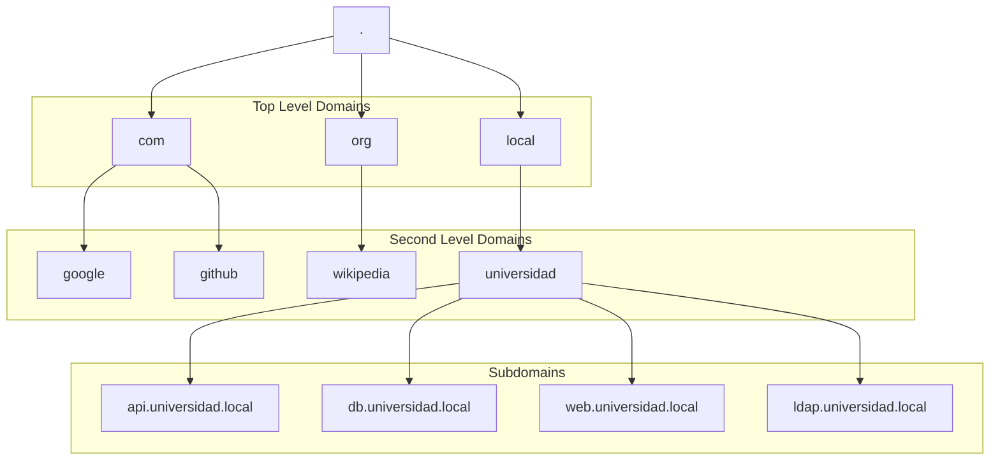
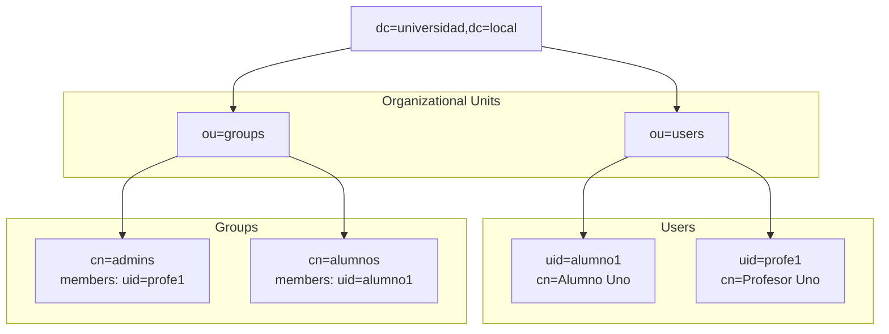

- [6. Servicios de Red e Infraestructura y Orquestación](#6-servicios-de-red-e-infraestructura-y-orquestación)
  - [6.1. DNS con BIND9: El Mapa de la Red](#61-dns-con-bind9-el-mapa-de-la-red)
    - [6.1.1. ¿Por qué no usamos IPs? El problema de la volatilidad](#611-por-qué-no-usamos-ips-el-problema-de-la-volatilidad)
    - [6.1.2. Jerarquía y Árbol DNS](#612-jerarquía-y-árbol-dns)
    - [6.1.3. 🛠️ Laboratorio Completo: Servidor BIND9 en Docker](#️-laboratorio-completo-servidor-bind9-en-docker)
    - [6.1.4. Pruebas de Validación: dig, nslookup y host](#614-pruebas-de-validación-dig-nslookup-y-host)
  - [6.2. Servicios de Directorio: LDAP](#62-servicios-de-directorio-ldap)
    - [6.2.1. ¿Por qué LDAP y no una tabla en SQL?](#621-por-qué-ldap-y-no-una-tabla-en-sql)
    - [6.2.2. Escenarios de Uso Real: La identidad única](#622-escenarios-de-uso-real-la-identidad-única)
    - [6.2.3. Estructura DIT (Directory Information Tree)](#623-estructura-dit-directory-information-tree)
    - [6.2.4. 🛠️ Laboratorio Completo: OpenLDAP + phpLDAPadmin](#️-laboratorio-completo-openldap--phpldapadmin)
    - [6.2.5. Pruebas de Validación: ldapsearch](#625-pruebas-de-validación-ldapsearch)
  - [6.3. Integración en Aplicaciones (Auth LDAP)](#63-integración-en-aplicaciones-auth-ldap)
    - [6.3.1. Implementación en Java 25 (Spring Boot 3.4+)](#631-implementación-en-java-25-spring-boot-34)
    - [6.3.2. Implementación en .NET 10 (C# 14)](#632-implementación-en-net-10-c-14)
  - [6.4. Seguridad en el Servidor Web: Auth LDAP en el Proxy](#64-seguridad-en-el-servidor-web-auth-ldap-en-el-proxy)
    - [6.4.1. Escenario: El Escudo de Red](#641-escenario-el-escudo-de-red)
    - [6.4.2. Configuración en Apache (mod\_authnz\_ldap)](#642-configuración-en-apache-mod_authnz_ldap)
      - [6.4.2.1. Instalación y Activación](#6421-instalación-y-activación)
      - [6.4.2.2. Supuesto Práctico: Carpeta de Nóminas Privada](#6422-supuesto-práctico-carpeta-de-nóminas-privada)
    - [6.4.3. Configuración en Nginx (auth\_ldap)](#643-configuración-en-nginx-auth_ldap)
      - [6.4.3.1. Instalación](#6431-instalación)
      - [6.4.3.2. Supuesto Práctico: Panel de Control Externo](#6432-supuesto-práctico-panel-de-control-externo)
  - [6.5. Orquestación Final: El Entorno de Producción](#65-orquestación-final-el-entorno-de-producción)
    - [6.5.1. Arquitectura del Sistema](#651-arquitectura-del-sistema)
    - [6.5.2. El "Final Boss": Docker Compose Integral](#652-el-final-boss-docker-compose-integral)
    - [6.5.3. Validación Automática con Playwright](#653-validación-automática-con-playwright)


# 6. Servicios de Red e Infraestructura y Orquestación


## 6.1. DNS con BIND9: El Mapa de la Red

### 6.1.1. ¿Por qué no usamos IPs? El problema de la volatilidad
Imagina que configuras tu aplicación para conectar a la base de datos en la IP `192.168.1.50`. Mañana, el equipo de sistemas migra la base de datos a un servidor más potente con la IP `192.168.1.60`.
*   **Sin DNS:** Tienes que entrar en el código o configuración de 20 microservicios, cambiar la IP y volver a desplegar. **Riesgo de error: Alto**.
*   **Con DNS:** Tu App busca `db.universidad.local`. Solo se cambia un registro en el servidor DNS. La App sigue funcionando sin enterarse del cambio físico.

### 6.1.2. Jerarquía y Árbol DNS



El DNS se organiza de forma arbórea y jerárquica:

| Tipo | Propósito | Ejemplo |
| :--- | :--- | :--- |
| **A** | Mapea un nombre a una dirección IPv4. | `api -> 192.168.200.30` |
| **AAAA** | Mapea un nombre a una dirección IPv6. | `api -> 2001:db8::1` |
| **CNAME** | Alias de otro nombre (Canonical Name). | `www -> webapp` |
| **MX** | Mail Exchange: indica el servidor de correo. | `universidad.local -> mail.univ.local` |
| **PTR** | Resolución Inversa: de IP a Nombre. | `192.168.200.30 -> api.univ.local` |
| **SRV** | Localización de servicios (ej. LDAP). | `_ldap._tcp -> ldap.univ.local` |

---

### 6.1.3. 🛠️ Laboratorio Completo: Servidor BIND9 en Docker

**1. named.conf.local (Definición de Zonas):**
```conf
zone "universidad.local" {
    type master;
    file "/etc/bind/zones/db.universidad.local";
};

zone "200.168.192.in-addr.arpa" {
    type master;
    file "/etc/bind/zones/db.192.168.200";
};
```

**2. db.universidad.local (Zona Directa):**
```conf
$TTL    86400
@       IN      SOA     ns1.universidad.local. admin.universidad.local. (
                        2026010501 ; Serial
                        3600       ; Refresh
                        1800       ; Retry
                        604800     ; Expire
                        86400 )    ; Minimum
;
@       IN      NS      ns1.universidad.local.
ns1     IN      A       192.168.200.2
proxy   IN      A       192.168.200.10
webapp  IN      A       192.168.200.20
api     IN      A       192.168.200.30
db      IN      A       192.168.200.40
ldap    IN      A       192.168.200.50

www     IN      CNAME   webapp
database IN     CNAME   db
```

### 6.1.4. Pruebas de Validación: dig, nslookup y host
*   **dig:** `dig @192.168.200.2 api.universidad.local`. Muestra toda la respuesta DNS, incluyendo tiempos.
*   **nslookup:** `nslookup www.universidad.local 192.168.200.2`. Herramienta clásica y sencilla.
*   **host:** `host 192.168.200.30`. Ideal para probar la resolución inversa (PTR).

---

## 6.2. Servicios de Directorio: LDAP

### 6.2.1. ¿Por qué LDAP y no una tabla en SQL?
1.  **Lectura Ultrarrápida:** LDAP está optimizado para búsquedas constantes (logins) frente a SQL que es mejor para escritura/relaciones complejas.
2.  **Estándar Universal:** Cualquier software (VPN, Jenkins, Jira) sabe hablar LDAP de forma nativa.
3.  **Gestión Centralizada:** Un solo sitio para gestionar la identidad de toda la empresa.

### 6.2.2. Escenarios de Uso Real: La identidad única
*   **Onboarding/Offboarding:** Creas el usuario una vez y tiene acceso a todo. Lo borras una vez y pierde acceso a todo (SSO).
*   **Políticas de Grupo:** Permite decir que "Solo los del grupo Profesores pueden entrar en la App de Actas".

### 6.2.3. Estructura DIT (Directory Information Tree)



LDAP organiza los datos como un árbol invertido:
*   **DN (Distinguished Name):** La ruta absoluta. `uid=alumno1,ou=users,dc=local`.
*   **RDN (Relative DN):** La parte relativa. `uid=alumno1`.
*   **OU (Organizational Unit):** Carpeta/Contenedor.
*   **dc (Domain Component):** Componentes del dominio.

---

### 6.2.4. 🛠️ Laboratorio Completo: OpenLDAP + phpLDAPadmin

**Archivo users.ldif:**
```ldif
dn: ou=users,dc=universidad,dc=local
objectClass: organizationalUnit
ou: users

dn: uid=profe1,ou=users,dc=universidad,dc=local
objectClass: inetOrgPerson
uid: profe1
cn: Profesor Uno
sn: Gonzalez
mail: profe1@universidad.local
userPassword: {SSHA}contraseña_encriptada
```

### 6.2.5. Pruebas de Validación: ldapsearch
Comando para buscar usuarios por consola:
```bash
ldapsearch -x -H ldap://localhost:389 -b "dc=universidad,dc=local" "(uid=profe1)"
```

---

## 6.3. Integración en Aplicaciones (Auth LDAP)

### 6.3.1. Implementación en Java 25 (Spring Boot 3.4+)
```java
public record UserIdentity(String uid, String email, List<String> roles) {}

@Configuration
@EnableWebSecurity
public class SecurityConfig {
    @Bean
    public SecurityFilterChain filterChain(HttpSecurity http) throws Exception {
        return http
            .csrf(csrf -> csrf.disable())
            .authorizeHttpRequests(auth -> auth
                .requestMatchers("/api/auth/**").permitAll()
                .anyRequest().authenticated()
            )
            .httpBasic(Customizer.withDefaults())
            .build();
    }

    @Bean
    public AuthenticationManager authManager(BaseLdapPathContextSource contextSource) {
        var factory = new LdapBindAuthenticationManagerFactory(contextSource);
        factory.setUserDnPatterns("uid={0},ou=users"); 
        return factory.createAuthenticationManager();
    }
}
```

### 6.3.2. Implementación en .NET 10 (C# 14)
```csharp
public class LdapAuthenticator(IConfiguration config) 
{
    private readonly string _host = config["Ldap:Host"] ?? "ldap.local";
    private readonly string _baseDn = config["Ldap:BaseDn"]!;

    public bool CheckLogin(string username, string password) 
    {
        using var connection = new LdapConnection();
        try {
            connection.Connect(_host, 389);
            connection.Bind($"uid={username},ou=users,{_baseDn}", password);
            return connection.Bound;
        } catch { return false; }
    }
}
```

## 6.4. Seguridad en el Servidor Web: Auth LDAP en el Proxy

### 6.4.1. Escenario: El Escudo de Red
A veces necesitamos proteger una ruta (ej: `/admin` o `/informes`) sin tocar una sola línea de código de nuestra aplicación Java o .NET. Esto es vital cuando:
1.  La aplicación es de terceros y no permite tocar su código.
2.  Queremos proteger archivos estáticos (PDFs, Logs).
3.  Buscamos una **doble capa de seguridad**: primero autentica el servidor web y luego la App.

---

### Configuración en Apache (mod_authnz_ldap)

#### 6.4.2.1. Instalación y Activación
En sistemas basados en Debian/Ubuntu o dentro de un contenedor Docker de Apache, debemos activar los módulos de LDAP:

```bash
# Activar el módulo base de LDAP y el de autenticación
a2enmod ldap
a2enmod authnz_ldap

# Reiniciar Apache para aplicar cambios
systemctl restart apache2
```

#### 6.4.2.2. Supuesto Práctico: Carpeta de Nóminas Privada
**Objetivo:** Solo los usuarios del grupo `recursos-humanos` pueden acceder a los PDFs en `/var/www/html/nominas`.

**Fichero de configuración (`/etc/apache2/sites-available/000-default.conf`):**
```apache
<Directory "/var/www/html/nominas">
    AuthName "Acceso Restringido - Personal de RRHH"
    AuthType Basic
    AuthBasicProvider ldap

    # URL de conexión: servidor, puerto, base DN, atributo de búsqueda (uid)
    AuthLDAPURL "ldap://ldap.local:389/ou=users,dc=universidad,dc=local?uid?sub?(objectClass=*)"
    
    # Usuario 'admin' que Apache usará para leer el directorio
    AuthLDAPBindDN "cn=admin,dc=universidad,dc=local"
    AuthLDAPBindPassword "admin_secret"

    # Restricción por grupo
    Require ldap-group cn=recursos-humanos,ou=groups,dc=universidad,dc=local
</Directory>
```

---

### Configuración en Nginx (auth_ldap)

#### 6.4.3.1. Instalación
Nginx no incluye LDAP en su versión core. La forma más profesional de obtenerlo es:
*   **En Debian/Ubuntu:** Instalar el paquete `nginx-extras` que incluye módulos adicionales.
*   **En Docker:** Usar imágenes que ya lo incluyan, como `bitnami/nginx` o construir una propia con el módulo `nginx-auth-ldap`.

```bash
# Instalación en servidor Linux real
sudo apt-get update
sudo apt-get install nginx-extras
```

#### 6.4.3.2. Supuesto Práctico: Panel de Control Externo
**Objetivo:** Proteger un panel de control que corre en otro servidor (`http://10.0.0.50:9000`) para que solo los `admins` entren.

**Fichero `nginx.conf`:**
```nginx
http {
    # Definimos la conexión al servidor LDAP una sola vez
    ldap_server univ_ldap {
        url ldap://ldap.local:389/ou=users,dc=local?uid?sub?(objectClass=*);
        binddn "cn=admin,dc=local";
        bindpw "admin_secret";
        group_attribute member;
        group_attribute_is_dn on;
        require group "cn=admins,ou=groups,dc=local";
    }

    server {
        listen 80;
        
        location /panel-control {
            auth_ldap "Introduzca credenciales de Administrador";
            auth_ldap_servers univ_ldap;
            
            # Si el login es correcto, hace el proxy
            proxy_pass http://10.0.0.50:9000;
        }
    }
}
```

💡 **Nota del Profesor:** Recordad que al usar `AuthType Basic`, las contraseñas viajan en el header de la petición codificadas en Base64. En un entorno de producción real, **es obligatorio usar HTTPS** para que esa información viaje cifrada y nadie pueda capturarla. 🛡️


    - [Arquitectura del Sistema](#arquitectura-del-sistema)
    - [El "Final Boss": Docker Compose Integral](#el-final-boss-docker-compose-integral)
    - [Validación Automática con Playwright](#validación-automática-con-playwright)

---

---

## 6.5. Orquestación Final: El Entorno de Producción

### 6.5.1. Arquitectura del Sistema

```mermaid
flowchart TB
    Internet["Internet"]
    
    subgraph Proxy["Proxy/Ingress"]
        Nginx["Nginx<br/>Reverse Proxy<br/>Auth LDAP"]
    end
    
    subgraph Front["Frontend"]
        React["React App<br/>Puerto 3000"]
    end
    
    subgraph Back["Backend"]
        API["Java/C# API<br/>Puerto 8080"]
        Auth["Auth Service<br/>LDAP Integration"]
    end
    
    subgraph Data["Data Layer"]
        DB[(("PostgreSQL<br/>Puerto 5432"))]
        LDAP["OpenLDAP<br/>Puerto 389"]
        DNS["BIND9<br/>Puerto 53"]
    end
    
    subgraph Test["QA Layer"]
        Playwright["Playwright<br/>E2E Tests"]
    end
    
    Internet --> Nginx
    Nginx --> React
    Nginx --> API
    API --> Auth
    Auth --> LDAP
    API --> DB
    React --> Playwright
    
```

## 6.5. Orquestación Final: El Entorno de Producción
```yaml
services:
  dns:
    image: ubuntu/bind9:latest
    volumes:
      - ./dns/zones:/etc/bind/zones
    networks:
      servicios-net:
        ipv4_address: 192.168.200.2

  ldap:
    image: osixia/openldap:1.5.0
    environment:
      - LDAP_DOMAIN=universidad.local
      - LDAP_ADMIN_PASSWORD=admin
    networks:
      - servicios-net

  api:
    build: ./backend
    dns:
      - 192.168.200.2
    depends_on:
      - ldap
    networks:
      - servicios-net

  tester:
    image: mcr.microsoft.com/playwright:v1.49.0-jammy
    volumes:
      - ./tests:/app
    command: npx playwright test
    depends_on:
      api:
        condition: service_healthy
    networks:
      - servicios-net

networks:
  servicios-net:
    ipam:
      config:
        - subnet: 192.168.200.0/24
```

### 6.5.3. Validación Automática con Playwright
El servicio `tester` certifica el despliegue. Playwright entra en la web, hace login contra LDAP y verifica la base de datos. Si falla, el despliegue se cancela automáticamente.

💡 **Nota Final del Profesor:** Dominar DNS y LDAP os convierte en arquitectos de sistemas, no solo en programadores. ¡A por ello! 🚀